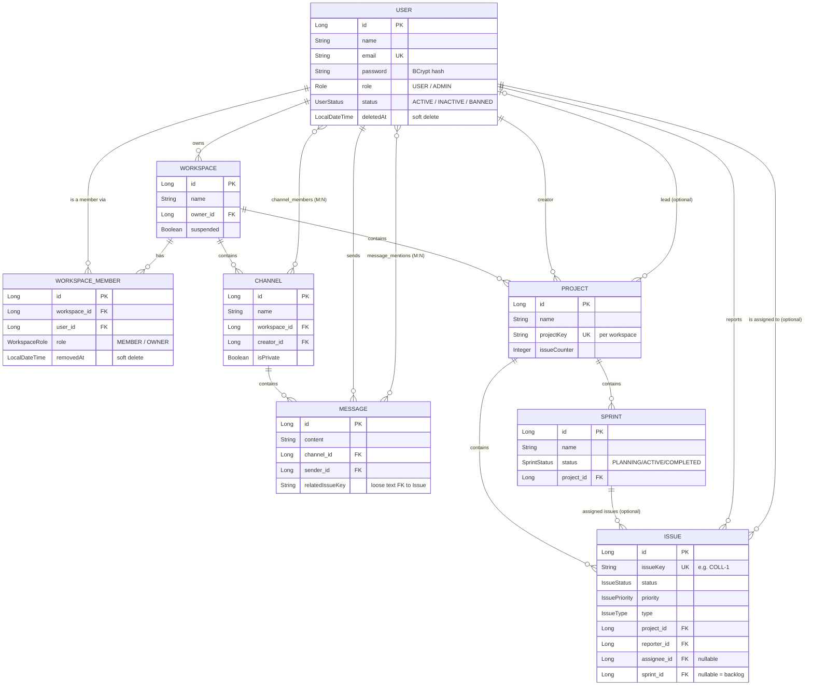
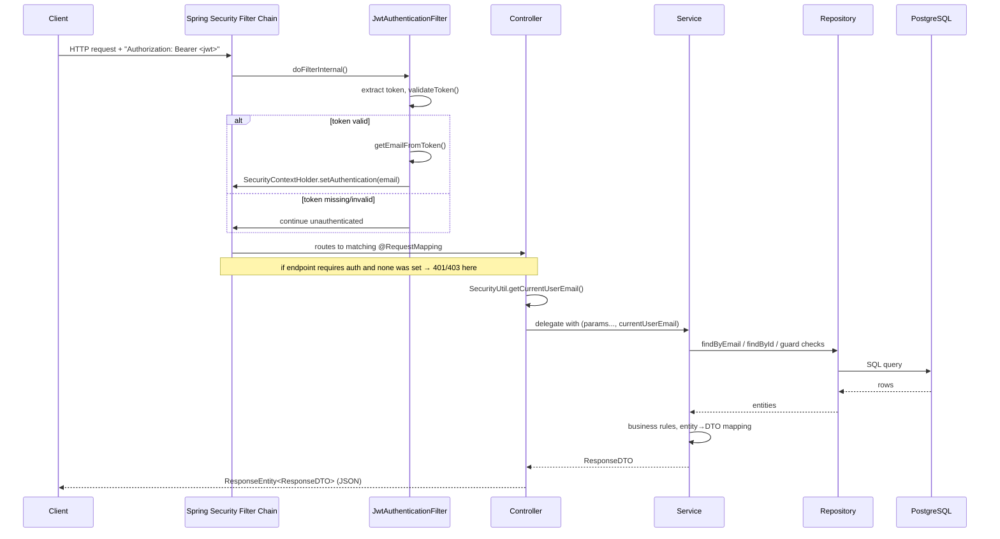

# CollabHub — Master Overview & Architecture Guide

> **Read this file first.** Every other file in this documentation set (01 through 10) assumes you understand the concepts explained here: the tech stack, the layered architecture, the "standard guard block" pattern, and how modules talk to each other. Once you're comfortable with this file, the per-service docs will read like variations on a theme rather than 10 unrelated codebases.

---

## 1. What is CollabHub?

CollabHub is a **Spring Boot backend** that fuses two products you already know into one API:

- **Slack-style team chat** — Workspaces → Channels → Messages (with reactions, mentions, real-time delivery).
- **Jira-style project tracking** — Workspaces → Projects → Issues → Sprints → Kanban Board.

Both halves share the same `Workspace` and `User` foundation, which is why the codebase is organized as **one Spring Boot application with 9 feature modules** rather than two separate services. A `Workspace` is the tenant boundary: everything (channels, projects, sprints) lives inside exactly one workspace, and workspace membership is the gate that controls who can see what.

```
Workspace  (the "company" / "team" — the tenant boundary)
 ├── Channel        → Message          (Slack side)
 └── Project         → Issue ⇄ Sprint  → Board  (Jira side)
```

---

## 2. Technology Stack

| Concern | Technology | Where configured |
|---|---|---|
| Language / runtime | Java 17 | `pom.xml` |
| Framework | Spring Boot 4.0.5 | `pom.xml` (`spring-boot-starter-parent`) |
| Web layer | Spring MVC (`spring-boot-starter-webmvc`) | REST controllers |
| Persistence | Spring Data JPA + Hibernate | `spring-boot-starter-data-jpa` |
| Database | PostgreSQL | `application.properties` |
| Security | Spring Security (stateless, JWT) | `SecurityConfig`, `auth` module |
| Real-time | Spring WebSocket + STOMP | `StompWebSocketConfig`, `message`/`issue` modules |
| Boilerplate reduction | Lombok (`@Data`, `@Builder`, `@Slf4j`, `@RequiredArgsConstructor`) | throughout |
| Validation | Jakarta Bean Validation (`@NotBlank`, `@Size`, `@Pattern`, …) | DTOs |
| Token library | `jjwt` (io.jsonwebtoken) 0.11.5 | `JwtTokenProvider` |

**Why these choices, in one line each:**
- **Spring Boot** — batteries-included convention-over-configuration framework; the de-facto standard for Java REST backends, huge ecosystem, auto-configuration removes boilerplate wiring.
- **PostgreSQL** — a mature, free, ACID-compliant relational database; a good fit because the domain is highly relational (users belong to workspaces, own channels, report issues, etc. — lots of foreign keys).
- **JWT + Stateless Security** — the API is consumed by a separate frontend (SPA) and possibly mobile apps; stateless tokens mean no server-side session storage, which makes the backend trivially horizontally-scalable (any server can validate any request without shared session state).
- **STOMP over WebSocket** — plain WebSockets only give you raw byte/text frames. STOMP adds a lightweight messaging protocol on top (destinations like `/topic/messages`, subscribe/publish semantics) so Spring can act as a message broker without needing an external one like RabbitMQ.
- **Lombok** — Java entity/DTO classes are naturally verbose (getters, setters, constructors, builders, toString). Lombok generates all of that at compile time from annotations, so the actual code stays focused on business logic.

---

## 3. High-Level Architecture: The Layered Pattern

Every single feature module in this codebase (auth, user, workspace, channel, message, project, issue, sprint, admin) follows the **exact same 4-layer structure**. Learn it once here, recognize it everywhere else.

```
┌─────────────────────────────────────────────────────────────┐
│  Controller Layer   (@RestController)                        │
│  - Receives HTTP requests                                    │
│  - Validates request shape (@Valid)                          │
│  - Extracts "who is calling" from the security context       │
│  - Delegates to the Service layer                            │
│  - Wraps the result in a ResponseEntity with the right status│
└───────────────────────────┬────────────────────────────────┘
                             │ calls
┌───────────────────────────▼────────────────────────────────┐
│  Service Layer   (interface + *Impl, @Service)               │
│  - ALL business logic and authorization rules live here      │
│  - Talks to one or more repositories                         │
│  - Converts Entities ↔ DTOs                                  │
│  - Throws domain-specific exceptions on rule violations       │
└───────────────────────────┬────────────────────────────────┘
                             │ calls
┌───────────────────────────▼────────────────────────────────┐
│  Repository Layer   (interface extends JpaRepository)        │
│  - Pure data access, no business logic                       │
│  - Spring Data generates the implementation at runtime        │
│  - Custom queries via method names or @Query (JPQL)           │
└───────────────────────────┬────────────────────────────────┘
                             │ maps to
┌───────────────────────────▼────────────────────────────────┐
│  Entity Layer   (@Entity)                                    │
│  - Maps 1:1 to a database table                               │
│  - Hibernate turns these objects into SQL                     │
└─────────────────────────────────────────────────────────────┘
```

**DTOs (Data Transfer Objects)** sit alongside this stack, not inside it. They are the "public shape" of data that crosses the wire (`XxxRequestDTO` for input, `XxxResponseDTO` for output). **Entities never go directly to the client.** This is a deliberate, important decision.

### Package-by-feature, not package-by-layer

Notice the codebase is organized as:

```
com.collabHub.
 ├── user/        { controller, dto, entity, repository, service }
 ├── workspace/   { controller, dto, entity, repository, service }
 ├── channel/     { controller, dto, entity, repository, service }
 ├── message/     { controller, dto, entity, repository, service }
 ├── project/     { controller, dto, entity, repository, service }
 ├── issue/       { controller, dto, entity, repository, service }
 ├── sprint/      { controller, dto, entity, repository, service }
 ├── admin/       { controller, dto, service }
 ├── auth/        { controller, dto, security, service }
 ├── common/      { exception, util }        ← shared across all modules
 ├── config/      { SecurityConfig, StompWebSocketConfig }
 └── listener/    { WebSocketConnectListener }
```

This is called **"package by feature"** (as opposed to "package by layer", where you'd have one giant `controllers/` folder with every controller in it). The advantage: everything related to "Channel" — its entity, its DTOs, its repository, its service, its controller — lives in one folder. You can delete the entire `channel/` package and the app still compiles cleanly against the other modules (loose coupling). It also scales better with team size: two developers working on `issue/` and `message/` rarely touch the same file.

---

## 4. The "Standard Guard Block" — the codebase's most repeated pattern

If you read only one pattern before diving into the per-service docs, read this one. **Almost every service method in this codebase starts with the same three checks**, in this order:

```java
User user = userRepository.findByEmail(email)
        .orElseThrow(() -> new UserNotFoundException("User not found"));

if (user.getDeletedAt() != null) {
    throw new UserNotFoundException("User account is deleted");
}

if (UserStatus.BANNED.equals(user.getStatus())) {
    throw new UserBannedException("Your account has been banned. You cannot perform this action.");
}
```

**Why these three, and why this order?**

1. **Does the user exist at all?** — The JWT filter already proved the token is valid and told us the caller's email, but the user row could have been deleted after the token was issued. We re-verify against the database on every request rather than trusting the token's claims.
2. **Is the account soft-deleted?** — CollabHub never hard-deletes a `User` row (Soft Delete). A `deletedAt` timestamp marks the account as gone. Every read/write path must re-check this, because a soft-deleted user's row is still physically present and would otherwise "work".
3. **Is the account banned?** — Distinct from deletion. An admin can `BANNED` a user (see the Admin service doc) to block *all* actions without erasing their data or history (their old messages/issues stay attributed to them).

Later in the `project`, `issue`, and `sprint` modules this exact three-step block was extracted into a small private helper called `findActiveUser(String email)` — a nice example of **refactoring for DRY (Don't Repeat Yourself)** once a pattern proves itself stable across several modules.

A second, equally common guard checks **workspace membership**:

```java
boolean isMember = workspaceMemberRepository
        .findByWorkspaceIdAndUserIdAndRemovedAtIsNull(workspaceId, userId)
        .isPresent();
if (!isMember) {
    throw new UserAccessDeniedException("You are not a member of this workspace");
}
```

This is the **tenant isolation check**: because every channel, project, sprint, and issue belongs to exactly one workspace, and a workspace is only visible to its members, this single check is what stops User A in Workspace 1 from seeing anything inside Workspace 2. It is repeated (or wrapped in a `requireWorkspaceMember()` helper) in nearly every service.

A third common guard checks **workspace suspension**:

```java
if (workspace.getSuspended()) {
    throw new WorkspaceSuspendedException("This workspace has been suspended...");
}
```

Admins can suspend a misbehaving workspace (see the Admin doc). A suspended workspace becomes **read-frozen** for write operations across every module — you cannot create channels, projects, messages, or issues inside it, even if you're the owner.

---

## 5. Cross-Cutting Design Decisions (apply to the whole app)

### 5.1 DTOs — never expose entities directly

Every controller method returns a `*ResponseDTO`, never a JPA `@Entity`. Reasons:

- **Prevents accidental data leaks.** `User.password` (a BCrypt hash) must never leave the server. If controllers returned `User` directly, a developer could easily forget to exclude it. DTOs are hand-built with only the fields that are safe to expose (see `UserResponseDTO`, which has no `password` field at all).
- **Breaks the Hibernate lazy-loading trap.** Entities have `@ManyToOne(fetch = FetchType.LAZY)` associations (e.g. `Channel.workspace`). If you serialize an entity straight to JSON *outside* of an open Hibernate session, you get a `LazyInitializationException`. DTOs are flat, already-resolved data, so this problem disappears entirely.
- **Decouples the wire format from the schema.** You can rename or restructure a database column without breaking every API consumer, as long as you keep mapping it into the same DTO field.
- **Input validation.** Request DTOs (`CreateChannelDTO`, `UserRequestDTO`, …) carry Jakarta Validation annotations (`@NotBlank`, `@Size`, `@Pattern`, `@Email`) that are meaningless on an `@Entity` (which has its own, different set of `@Column` constraints for the database).

### 5.2 Soft delete over hard delete (mostly)

`User` and `WorkspaceMember` use **soft delete**: instead of `DELETE FROM users WHERE id = ?`, the code sets a `deletedAt` timestamp (`User`) or `removedAt` timestamp (`WorkspaceMember`) and leaves the row in place.

**Why:** A user who is "deleted" may still be referenced as the `sender` of old messages, the `creator` of a channel, or the `reporter` of an issue (all of these are `@ManyToOne` foreign keys that are `nullable = false`). Hard-deleting the user row would either violate the foreign key constraint or force those historical records to lose their author. Soft delete preserves referential integrity and history while still making the account effectively "gone" (the guard block in §4 rejects it everywhere).

Contrast this with **`Workspace`, `Channel`, `Message`, `Project`, and `Issue` deletion**, which *is* a hard delete (`repository.delete(entity)`). These are deliberately different: deleting a workspace is an explicit, rare, owner-only action where cascading cleanup (deleting its members, channels, etc.) is the whole point, not something you want to "undo" later.

### 5.3 Role model: two layers, not one

There are **two separate, independent role systems** in this codebase — don't confuse them:

| Role system | Enum | Scope | Purpose |
|---|---|---|---|
| **Global role** | `user.entity.Role` → `USER`, `ADMIN` | Whole application | Determines platform-wide admin powers (ban users, suspend workspaces, view all data) |
| **Workspace role** | `workspace.entity.WorkspaceRole` → `MEMBER`, `OWNER` | One specific workspace | Determines who can manage members/settings *inside that one workspace* |

A platform `ADMIN` and a workspace `OWNER` are unrelated concepts. A platform `ADMIN` can bypass workspace-level ownership checks in some flows (e.g. `WorkspaceServiceImpl.isOwnerOrAdmin()`), but a workspace `OWNER` has no special power outside their own workspace.

### 5.4 Authorization is done in code, not with `@PreAuthorize`

You will not find `@PreAuthorize("hasRole('ADMIN')")` anywhere in this codebase. Instead, every service method that needs an authorization check does it manually with an `if` statement and a custom exception (see `AdminServiceImpl.verifyAdminRole()`, `WorkspaceServiceImpl.isOwnerOrAdmin()`, `ChannelServiceImpl.isChannelOwner()`). This is a deliberate trade-off:

- **Downside:** more boilerplate, easier to forget a check on a new endpoint.
- **Upside:** the rules here are not simple role checks — they're *relationship*-based ("are you the creator of **this specific** channel, or the owner of **the workspace it belongs to**?"). `@PreAuthorize` SpEL expressions can express this, but they get unreadable fast; a plain Java `if` with a descriptive exception message is easier for a new developer to follow and debug.

### 5.5 Exception-driven error handling

Business rule violations are modeled as custom **unchecked exceptions** (`UserNotFoundException`, `UserBannedException`, `WorkspaceSuspendedException`, `IssueNotFoundException`, …) defined in `common.exception`. A single `@RestControllerAdvice` class, `GlobalExceptionHandler`, catches each type centrally and converts it into a consistent JSON error shape with the right HTTP status:

```json
{ "success": false, "message": "You are not a member of this workspace", "status": 403 }
```

**Why centralize this?** Without a global handler, every controller method would need its own `try/catch`, producing inconsistent error JSON shapes across 9 modules. `@RestControllerAdvice` intercepts exceptions *after* they leave the controller, in one place, so the response format is guaranteed uniform. It also means service code can simply `throw new XyzException(...)` and never think about HTTP at all — a clean separation of concerns (services know about *business* errors; the exception handler knows about *HTTP* errors).

| Exception | Mapped HTTP Status |
|---|---|
| `UserAlreadyExistsException` | 409 Conflict |
| `UserNotFoundException` | 401 Unauthorized* |
| `UserAccessDeniedException` | 403 Forbidden |
| `UserBannedException` | 403 Forbidden |
| `ProjectNotFoundException`, `IssueNotFoundException`, `SprintNotFoundException` | 404 Not Found |
| `MethodArgumentNotValidException` (bean validation failures) | 400 Bad Request |
| Anything else (`Exception.class` catch-all) | 500 Internal Server Error |

\* Note: `UserNotFoundException` is mapped to 401 rather than 404. This is intentional in the login flow (`AuthServiceImpl.login`) — if a login fails, the response deliberately says "user not found" for both a wrong email *and* a wrong password, mapped to a generic 401. This avoids **user enumeration**: an attacker cannot tell whether an email is registered by observing different error messages for "email doesn't exist" vs "password is wrong". The same exception class, however, is reused in other (non-login) contexts where a 404-style "not found" is really what's meant — a minor inconsistency worth knowing about if you're debugging.

Two exceptions currently exist but are **not yet wired into `GlobalExceptionHandler`**: `ChannelNotFoundException` and `MessageNotFoundException`. When thrown, they fall through to the generic `Exception.class` handler and return `500` instead of a more correct `404`. This is a good example of something to flag when reviewing this codebase — a small inconsistency worth fixing.

### 5.6 `@Transactional` — where and why

Look for `@Transactional` on service methods that touch **more than one repository/table**, or need atomicity guarantees:

- `WorkspaceMemberServiceImpl.transferOwnership()` — demotes the old owner, promotes the new owner, and updates `Workspace.owner`, across 3 `save()` calls. If the server crashed after step 2 but before step 3, you'd have a workspace with two "owners" and inconsistent data. `@Transactional` wraps all three in one database transaction: either all three commit, or (on any exception) all three roll back.
- `SprintServiceImpl.completeSprint()` — moves N unfinished issues back to the backlog *and* marks the sprint completed. Both must succeed together.
- Most `create`/`update`/`delete` methods across `channel`, `project`, `issue`, `sprint` are marked `@Transactional` even for single-table writes, both for consistency and because Hibernate needs an active transaction to lazily resolve associations while building the response DTO.

`@Transactional(readOnly = true)` appears on pure lookup methods (e.g. `getIssueById`) as a hint to Hibernate that it can skip dirty-checking and use read-optimized behavior — a small performance win with no downside for a method that never calls `.save()`.

### 5.7 Lombok annotations used everywhere — quick reference

| Annotation | What it generates | Used on |
|---|---|---|
| `@Data` | Getters, setters, `equals()`, `hashCode()`, `toString()` | Entities |
| `@Getter` / `@Setter` | Just getters / just setters | DTOs (paired, not `@Data`, to avoid entity-style `equals`/`hashCode` on plain data carriers) |
| `@NoArgsConstructor` | Empty constructor | Entities & DTOs (required by JPA and by Jackson deserialization) |
| `@AllArgsConstructor` | Constructor with every field | Entities & DTOs |
| `@Builder` | Fluent builder pattern: `User.builder().name(...).email(...).build()` | Entities & DTOs — used everywhere instead of long constructor calls or setter chains, because it's self-documenting at the call site (`.name("Bob")` is clearer than a positional constructor argument) |
| `@Builder.Default` | Keeps a field's default value when using the builder (otherwise `@Builder` silently resets it to `null`/`0`) | e.g. `UserStatus status = UserStatus.ACTIVE;` |
| `@RequiredArgsConstructor` | Constructor for every `final` field | Services & Controllers — this is **how dependency injection happens** in this codebase (see §5.8) |
| `@Slf4j` | Injects a `private static final Logger log` field | Services & Controllers, used for `log.info(...)`, `log.warn(...)`, `log.error(...)` |

### 5.8 Dependency Injection style: constructor injection via Lombok

You will never see `@Autowired` on a field in this codebase. Instead every service/controller declares its dependencies as `private final` fields and puts `@RequiredArgsConstructor` on the class:

```java
@Service
@RequiredArgsConstructor
public class WorkspaceServiceImpl implements WorkspaceService {
    private final WorkspaceRepository workspaceRepository;
    private final UserRepository userRepository;
    private final WorkspaceMemberRepository memberRepository;
    // Lombok generates:
    // public WorkspaceServiceImpl(WorkspaceRepository workspaceRepository, UserRepository userRepository, WorkspaceMemberRepository memberRepository) { ... }
}
```

Spring sees there's exactly one constructor and automatically injects a bean for each parameter — this is **constructor injection**, considered best practice over field injection because: (1) fields can be `final`, guaranteeing they're never reassigned after construction; (2) the class is trivially unit-testable by calling `new WorkspaceServiceImpl(mockRepo1, mockRepo2, mockRepo3)` with no Spring context needed; (3) missing dependencies fail fast at startup instead of silently being `null` at runtime.

---

## 6. The Global Entity-Relationship Model

Below is the complete data model across every module. Study this once — every per-service doc references pieces of this diagram.



**Two relationships deserve special attention because they're deliberately *not* real foreign keys:**

1. **`Message.relatedIssueKey`** is a plain `String` (e.g. `"COLL-1"`), not a `@ManyToOne` to `Issue`. See the code comment in `Message.java` — this is a conscious decoupling decision so that deleting an `Issue` never cascades into deleting or breaking a `Message`, and the `message` package never needs to depend on the `issue` package.
2. **Workspace membership vs. ownership** is modeled twice: `Workspace.owner` (a direct FK, "the current owner") *and* a `WorkspaceMember` row with `role = OWNER` (so the owner also appears in the members list). Ownership transfer (see the Workspace doc) has to keep both in sync — this is exactly why that operation needs `@Transactional`.

---

## 7. Request Lifecycle — how one HTTP request actually flows through the app



Every module's controller follows step 6 (`SecurityUtil.getCurrentUserEmail()`) identically — this static utility reads `SecurityContextHolder.getContext().getAuthentication().getName()`, which is the email the `JwtAuthenticationFilter` placed there. **The controller never trusts a `userId`/`email` passed in the request body for "who am I" purposes** — it's always taken from the verified token. Only "whose profile/resource am I acting *on*" comes from path variables (e.g. `/api/users/{id}`).

---

## 8. Security Configuration Deep Dive (`SecurityConfig`)

```java
@Configuration
@EnableWebSecurity
@RequiredArgsConstructor
public class SecurityConfig {
    @Bean
    public PasswordEncoder passwordEncoder() { return new BCryptPasswordEncoder(); }

    @Bean
    public SecurityFilterChain filterChain(HttpSecurity http) throws Exception {
        http
            .csrf(csrf -> csrf.disable())
            .cors(cors -> cors.configurationSource(corsConfigurationSource()))
            .sessionManagement(session -> session.sessionCreationPolicy(SessionCreationPolicy.STATELESS))
            .authorizeHttpRequests(auth -> auth
                .requestMatchers("/api/users/register", "/api/auth/login").permitAll()
                .requestMatchers("/api/health").permitAll()
                .requestMatchers("/ws/**").permitAll()
                .requestMatchers("/ws-test.html","/ws-sprint-test.html","/").permitAll()
                .anyRequest().authenticated()
            );
        http.addFilterBefore(jwtAuthenticationFilter, UsernamePasswordAuthenticationFilter.class);
        return http.build();
    }
    ...
}
```

Line-by-line reasoning:

- **`csrf().disable()`** — CSRF (Cross-Site Request Forgery) protection exists to protect *cookie/session-based* authentication, where a browser automatically attaches cookies to any request, even ones triggered by a malicious third-party page. This API uses **stateless JWT bearer tokens** sent explicitly in an `Authorization` header, which a malicious page cannot forge (it doesn't have access to read `localStorage`/memory-held tokens cross-origin). CSRF protection is therefore not applicable and would only add friction.
- **`sessionCreationPolicy(STATELESS)`** — tells Spring Security "never create or use an `HttpSession`". Every request must carry full proof of identity (the JWT) — this is what makes the API horizontally scalable (no sticky sessions, no shared session store needed).
- **Public endpoints (`permitAll()`)** — registration and login obviously must be reachable without already being logged in. `/ws/**` is public at the HTTP handshake level because the actual WebSocket authentication happens differently (the STOMP client passes the JWT to identify the sender when *sending* a chat message via the REST endpoint, not during the socket handshake itself — see the Message/Realtime doc for the full explanation). The two `ws-*.html` test pages are static manual-testing tools (open them in a browser to manually exercise the WebSocket flow) and are intentionally left public for convenience.
- **`anyRequest().authenticated()`** — the default-deny posture: everything not explicitly listed above requires a valid JWT.
- **`addFilterBefore(jwtAuthenticationFilter, UsernamePasswordAuthenticationFilter.class)`** — inserts our custom filter *before* Spring Security's built-in username/password filter in the chain, ensuring JWT-based authentication is attempted first (and, since this API has no form login, the built-in filter never actually fires — it's just the anchor point Spring's filter-ordering API needs).
- **`BCryptPasswordEncoder`** — BCrypt is a slow, salted, adaptive hashing algorithm purpose-built for passwords (unlike fast general-purpose hashes like SHA-256, which are *bad* for passwords because they're too fast to brute-force resist). Every password in the `users` table is a BCrypt hash, never plaintext.
- **CORS configuration** — restricts browser-based cross-origin calls to `http://localhost:8800` (the expected frontend dev origin). `allowCredentials(true)` + explicit origins (not `*`) because you cannot combine wildcard origins with credentialed requests per the CORS spec.

---

## 9. How to Use the Rest of This Documentation Set

| File | Covers |
|---|---|
| `01-AUTH-SERVICE.md` | Login, JWT issuing/validation, the security filter in detail |
| `02-USER-SERVICE.md` | Registration, profile CRUD, soft delete |
| `03-WORKSPACE-SERVICE.md` | Workspace CRUD + membership + ownership transfer |
| `04-CHANNEL-SERVICE.md` | Channels (public/private) + channel membership |
| `05-MESSAGE-AND-REALTIME-SERVICE.md` | Messaging, reactions, mentions, and the WebSocket/STOMP broadcast infrastructure |
| `06-PROJECT-SERVICE.md` | Jira-style projects, issue-key generation |
| `07-ISSUE-SERVICE.md` | Issues, filtering, real-time board events |
| `08-SPRINT-AND-BOARD-SERVICE.md` | Sprint lifecycle state machine + Kanban board assembly |
| `09-ADMIN-SERVICE.md` | Platform admin: user bans, workspace suspension, statistics |

Each of those files is self-contained but cross-references this overview for shared concepts (the guard block, DTO philosophy, exception handling, security). If a term feels unexplained in a per-service doc, it's almost certainly defined here.
