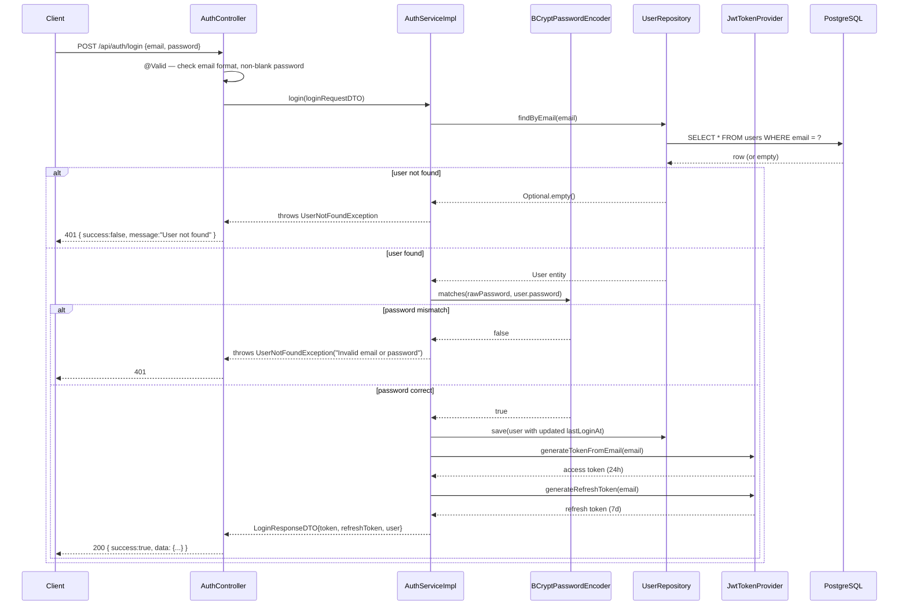
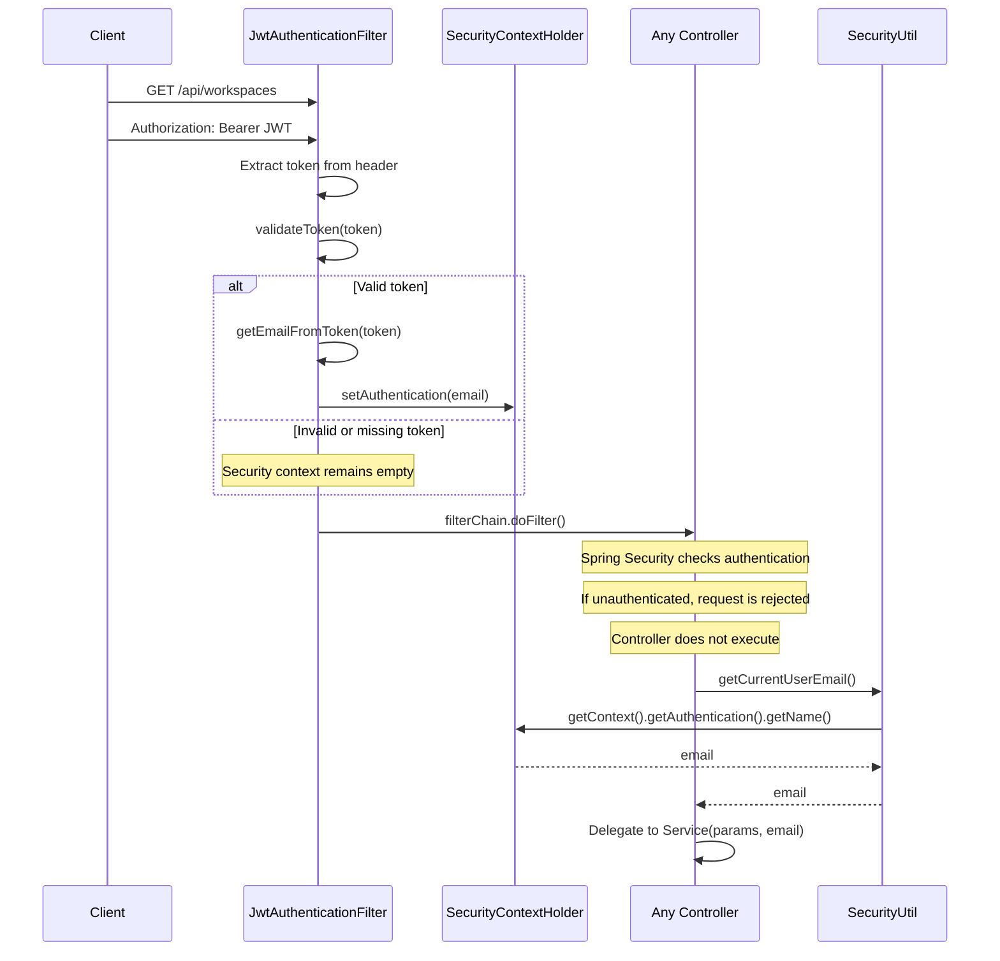

# 01 — Auth Service (Login, JWT, Security Filter)

> Prerequisite: read `00-OVERVIEW-AND-ARCHITECTURE.md` first, especially §7 (Request Lifecycle) and §8 (Security Configuration). This doc goes deep on the pieces that overview only summarized.

---

## 1. Purpose & Responsibility

The `auth` module answers exactly one question on every request: **"who is making this call, and is their proof of identity valid?"** It does **not** handle registration (that's `user` module's `POST /api/users/register`) — `auth` only handles:

1. **Login** — exchange an email + password for a JWT access token (and a longer-lived refresh token).
2. **Token issuing** — creating signed JWTs.
3. **Token validation** — verifying a JWT's signature and expiry on every subsequent request.
4. **Request-level authentication** — a servlet filter that runs before every request and populates Spring Security's context so controllers can ask "who is logged in?"

## 2. Package Structure

```
auth/
 ├── controller/
 │    └── AuthController.java        → POST /api/auth/login
 ├── dto/
 │    ├── LoginRequestDTO.java        → { email, password }
 │    ├── LoginResponseDTO.java       → { token, refreshToken, user{...} }
 │    └── AuthResponseDTO.java        → generic envelope { success, message, data, status }
 ├── security/
 │    ├── JwtTokenProvider.java       → creates & validates JWTs
 │    └── JwtAuthenticationFilter.java → runs on every request, reads the JWT
 └── service/
      ├── AuthService.java           → interface
      └── AuthServiceImpl.java       → login business logic
```

---

## 3. What is a JWT, and why use one here?

A **JSON Web Token (JWT)** is a self-contained, digitally-signed string that encodes claims (like "this is user bob@example.com, and this token expires at time X"). It has three dot-separated parts: `header.payload.signature`, all Base64URL-encoded. The signature is computed with a secret key that only the server knows, so:

- The server can verify a token wasn't tampered with (any change to the payload invalidates the signature).
- The server does **not** need to store anything about the token — no database lookup, no session table, no Redis. "Validating" a token is a pure, fast, cryptographic computation.

This is precisely why JWTs pair naturally with the **stateless** security model described in the overview (§8): a load balancer can route a request to *any* backend instance, and that instance can independently validate the token without needing to check a shared session store.

### The specific algorithm used: HMAC-SHA512 (`HS512`)

```java
return Jwts.builder()
        .setSubject(email)
        .setIssuedAt(now)
        .setExpiration(expiryDate)
        .signWith(getSigningKey(), SignatureAlgorithm.HS512)
        .compact();
```

`HS512` is a **symmetric** signing algorithm — the same secret key (`app.jwt.secret`, loaded from environment config) is used both to *sign* the token at login time and to *verify* it on every later request. This is simpler to operate than an asymmetric scheme (like `RS256`, which uses a private/public key pair) and is entirely appropriate here because signing and verifying both happen inside the same single backend service — there's no separate service that needs to verify tokens without being able to issue them.

---

## 4. `JwtTokenProvider` — Deep Dive

```java
@Component
public class JwtTokenProvider {

    @Value("${app.jwt.secret}")
    private String jwtSecret;

    @Value("${app.jwt.expiration}")        // 86400000 ms = 24 hours
    private long jwtExpirationMs;

    @Value("${app.jwt.refresh-expiration}") // 604800000 ms = 7 days
    private long refreshTokenExpirationMs;
    ...
```

**`@Component`** registers this as a plain Spring-managed bean (not `@Service`, because it's a low-level technical utility, not a business-logic service — a stylistic convention many Spring codebases follow: `@Service` for things that orchestrate business rules, `@Component`/`@Repository`/`@Controller` for their respective specialized roles).

**`@Value("${app.jwt.secret}")`** injects a value from `application.properties`:

```properties
app.jwt.secret=${JWT_KEY}
app.jwt.expiration=86400000
app.jwt.refresh-expiration=604800000
```

Note `${JWT_KEY}` — this is itself a placeholder resolved from an environment variable (or a local `.env.properties` file, see `spring.config.import=optional:file:.env[.properties]` at the top of `application.properties`). **The signing secret is never hardcoded in source control.** This matters enormously: anyone who obtains this secret can forge valid tokens for *any* user, so it must be a long, random, environment-specific secret injected at deploy time.

### Methods

| Method | Purpose |
|---|---|
| `generateTokenFromEmail(email)` | Builds a signed JWT with `subject = email`, `issuedAt = now`, `expiration = now + 24h`. Used at login time. |
| `generateRefreshToken(email)` | Same shape, but expires in 7 days instead of 24 hours. |
| `generateToken(Authentication)` | An alternate entry point that pulls the username off a Spring Security `Authentication` object — present for completeness/future use with Spring's built-in auth providers, though the actual login flow uses `generateTokenFromEmail` directly. |
| `validateToken(token)` | Attempts to parse the JWT with the signing key; returns `true` if it parses cleanly (valid signature *and* not expired — `jjwt`'s parser throws `ExpiredJwtException` automatically for expired tokens, which is caught here), `false` otherwise. |
| `getEmailFromToken(token)` | Parses the token's claims and returns the `subject` (the email) — this is how the filter learns "who" a valid token belongs to. |
| `isTokenExpired(token)` | Separately checks just the expiry claim; not currently called by the main auth flow but available for finer-grained checks (e.g. distinguishing "expired" from "invalid" in a future refresh-token endpoint). |

```java
private SecretKey getSigningKey() {
    byte[] keyBytes = jwtSecret.getBytes();
    return Keys.hmacShaKeyFor(keyBytes);
}
```

Every sign/verify operation derives the same `SecretKey` object from the same configured string, guaranteeing tokens signed at login can be verified later by the same key.

### Access token vs. refresh token — why two tokens?

- The **access token** (24h) is what's sent on every API request in the `Authorization: Bearer <token>` header. Short-lived by design: if it leaks, the exposure window is small.
- The **refresh token** (7 days) is returned once at login and is meant to be exchanged later for a new access token *without* forcing the user to log in with their password again, once that flow is implemented on the client side.

**Important, honest caveat for a code reviewer:** as of this codebase, there is **no `/api/auth/refresh` endpoint** — the refresh token is generated and returned by `login()`, but nothing consumes it yet. This is a partially-implemented feature; a natural next step for the project would be adding a refresh endpoint that accepts a refresh token and returns a new access token.

---

## 5. `JwtAuthenticationFilter` — the gatekeeper on every request

```java
@Component
@RequiredArgsConstructor
public class JwtAuthenticationFilter extends OncePerRequestFilter {

    private final JwtTokenProvider jwtTokenProvider;

    @Override
    protected void doFilterInternal(HttpServletRequest request, HttpServletResponse response, FilterChain filterChain)
            throws ServletException, IOException {
        try {
            String jwt = getJwtFromRequest(request);
            if (jwt != null && jwtTokenProvider.validateToken(jwt)) {
                String email = jwtTokenProvider.getEmailFromToken(jwt);
                UsernamePasswordAuthenticationToken authentication =
                        new UsernamePasswordAuthenticationToken(email, null, new ArrayList<>());
                authentication.setDetails(new WebAuthenticationDetailsSource().buildDetails(request));
                SecurityContextHolder.getContext().setAuthentication(authentication);
            }
        } catch (Exception ex) {
            log.error("Could not set authentication: {}", ex.getMessage());
        }
        filterChain.doFilter(request, response);
    }

    private String getJwtFromRequest(HttpServletRequest request) {
        String bearerToken = request.getHeader("Authorization");
        if (bearerToken != null && bearerToken.startsWith("Bearer ")) {
            return bearerToken.substring(7);
        }
        return null;
    }
}
```

**`extends OncePerRequestFilter`** — a Spring base class that guarantees this filter's logic runs **exactly once** per incoming HTTP request, even in environments where a request might otherwise be internally forwarded/dispatched multiple times (e.g. error dispatch, async dispatch). Writing a raw `javax.servlet.Filter` doesn't give you that guarantee for free.

**What it does, step by step:**

1. Reads the `Authorization` header, strips the `"Bearer "` prefix, leaving the raw token string.
2. If a token was present *and* `validateToken()` says it's cryptographically valid and unexpired, it extracts the email.
3. Builds a `UsernamePasswordAuthenticationToken(email, null, new ArrayList<>())`. Reading this constructor call carefully:
   - **Principal = `email`** — this is the identity Spring Security will remember as "the current user" for the rest of the request. This is exactly the string `SecurityUtil.getCurrentUserEmail()` (used throughout every controller) later reads back out.
   - **Credentials = `null`** — no password is carried forward; we already proved identity via the JWT signature, so there's nothing left to "credential-check" downstream.
   - **Authorities = `new ArrayList<>()`** — an **empty** list of granted authorities/roles. This is a deliberate and important detail: Spring Security's role-based method security (`@PreAuthorize("hasRole(...)")`) would find *zero* authorities here and always deny. This confirms the design decision noted in the overview (§5.4): **authorization in this codebase is done manually in service code**, not through Spring Security's role/authority mechanism. The filter's only job is *authentication* (proving who you are); *authorization* (what you're allowed to do) is handled later, deeper in the call stack, by hand-written checks against the `User.role` / `WorkspaceMember.role` database columns.
4. `SecurityContextHolder.getContext().setAuthentication(authentication)` — stores this on a `ThreadLocal`-backed context that's valid for the lifetime of the current request thread. Any code running later in the same request (controllers, services) can retrieve it.
5. **If no token, or an invalid token:** the filter simply does nothing and calls `filterChain.doFilter()` to continue — it does **not** reject the request itself. The request proceeds *unauthenticated*. It's `SecurityConfig`'s `.anyRequest().authenticated()` rule, evaluated later in the filter chain, that actually returns `401/403` for protected endpoints when no authentication was set. This separation (filter = "try to identify", config rule = "enforce that identification happened") keeps the filter simple and reusable regardless of which endpoints require auth.
6. The broad `try/catch (Exception ex)` around the whole block ensures a malformed or corrupted `Authorization` header can never crash the filter chain (and therefore the whole app) with an unhandled exception — worst case, the request is treated as unauthenticated and rejected normally by the security rules.

### `SecurityUtil.getCurrentUserEmail()` — the other end of this handoff

```java
public class SecurityUtil {
    public static String getCurrentUserEmail() {
        Authentication authentication = SecurityContextHolder.getContext().getAuthentication();
        if (authentication != null && authentication.isAuthenticated()) {
            return authentication.getName();
        }
        return null;
    }
}
```

Every controller in every module calls this one static method to answer "who is calling right now?". `authentication.getName()` returns the `principal` set by the filter above — the email. This little utility is the thread connecting §5's filter to every single business operation in the app; it's worth memorizing because you'll see `String currentUserEmail = SecurityUtil.getCurrentUserEmail();` as the very first line of nearly every controller method across all 9 modules.

---

## 6. `AuthServiceImpl.login()` — Business Logic

```java
@Override
public LoginResponseDTO login(LoginRequestDTO loginRequestDTO) {
    User user = userRepository.findByEmail(loginRequestDTO.getEmail())
            .orElseThrow(() -> new UserNotFoundException("User not found"));

    if (!passwordEncoder.matches(loginRequestDTO.getPassword(), user.getPassword())) {
        throw new UserNotFoundException("Invalid email or password");
    }

    user.setLastLoginAt(LocalDateTime.now());
    userRepository.save(user);

    String token = jwtTokenProvider.generateTokenFromEmail(user.getEmail());
    String refreshToken = jwtTokenProvider.generateRefreshToken(user.getEmail());

    return LoginResponseDTO.builder()
            .token(token)
            .refreshToken(refreshToken)
            .user(LoginResponseDTO.UserInfoDTO.builder()
                    .id(user.getId()).name(user.getName())
                    .email(user.getEmail()).role(user.getRole())
                    .build())
            .build();
}
```

Step by step:

1. **Look up by email.** If no such user exists, throw `UserNotFoundException("User not found")`.
2. **Verify the password** using `passwordEncoder.matches(rawPassword, storedHash)`. This is the correct, safe way to compare — you never decrypt a BCrypt hash back to plaintext (it's a one-way hash); `matches()` re-hashes the supplied plaintext with the same salt embedded in the stored hash and compares the results.
3. **If the password is wrong, throw the *same* exception type and a deliberately generic message** (`"Invalid email or password"`) rather than something like `"Wrong password"`. As explained in the overview §5.5, this prevents an attacker from using differing error messages to enumerate which emails are registered.
4. **On success, update `lastLoginAt`.** This single timestamp field powers several Admin statistics later (e.g. "users active this week/month" — see the Admin service doc), which is a good example of a small, cheap side-effect at login time paying off in a completely different module later.
5. **Issue both tokens** and build the response, including a nested `UserInfoDTO` so the frontend gets basic profile info (id, name, email, role) back immediately without a second round-trip call.

Notice **there is no explicit ban/soft-delete check inside `login()` itself.** A banned or soft-deleted user can still successfully authenticate (their password is still valid, and `findByEmail` doesn't filter deleted users here — contrast with `findActiveUserByEmail`, an *unused* repository method that exists but isn't called by the login flow). Instead, the ban/soft-delete rejection happens **on every subsequent business action** via the guard block (see overview §4) — e.g. a banned user gets a valid token but then gets `403 UserBannedException` the moment they try to create a workspace or send a message. This is a legitimate design choice (arguably even useful: a banned user can still see a "you are banned" message from an authenticated session rather than being stuck at a generic login failure) but it's worth knowing precisely where the enforcement boundary sits.

---

## 7. `AuthController` — the one endpoint

```java
@RestController
@RequestMapping("/api/auth")
@RequiredArgsConstructor
public class AuthController {
    private final AuthService authService;

    @PostMapping("/login")
    public ResponseEntity<AuthResponseDTO> login(@Valid @RequestBody LoginRequestDTO loginRequestDTO) {
        try {
            LoginResponseDTO response = authService.login(loginRequestDTO);
            return ResponseEntity.ok(AuthResponseDTO.builder()
                    .success(true).message("Login successful").data(response)
                    .status(HttpStatus.OK.value()).build());
        } catch (Exception ex) {
            return ResponseEntity.status(HttpStatus.UNAUTHORIZED).body(AuthResponseDTO.builder()
                    .success(false).message(ex.getMessage())
                    .status(HttpStatus.UNAUTHORIZED.value()).build());
        }
    }
}
```

Two things worth calling out:

1. **`@Valid @RequestBody LoginRequestDTO`** — triggers Jakarta Bean Validation on the incoming JSON body against the annotations on `LoginRequestDTO` (`@Email`, `@NotBlank`). If validation fails (e.g. malformed email, empty password), Spring throws `MethodArgumentNotValidException` *before* the controller body even runs, which `GlobalExceptionHandler` catches and turns into a `400 Bad Request` with a field-by-field error map.
2. **This is one of the few controllers in the whole codebase with a local `try/catch`.** Every other module's controllers let exceptions propagate up to `GlobalExceptionHandler`. Here, the catch is deliberate: *regardless* of what actually goes wrong inside `login()` (user not found, wrong password, or anything else), the controller forces the HTTP status to `401 Unauthorized` and wraps it in the module's own `AuthResponseDTO` envelope shape (`{success, message, data, status}`) rather than the generic error shape `GlobalExceptionHandler` would produce. This is a stylistic inconsistency worth noting if you're standardizing the codebase later — but functionally it correctly returns `401` for all login failures.

---

## 8. Complete Login Workflow — Sequence Diagram



## 9. Authenticated Request Workflow — Sequence Diagram

This is what happens on *every other* API call once the client has a token (e.g. `GET /api/workspaces`):


---

## 10. FAQ / Things You Should Be Able to Answer

**Q: What actually proves a user is who they say they are, on every request?**
A: The cryptographic signature on the JWT, verified with the server's secret key (`app.jwt.secret`) inside `JwtTokenProvider.validateToken()`. No database round-trip is needed to authenticate — only to look up the actual `User` row later once business logic needs more than just the email (e.g. checking ban status).

**Q: Why does `login()` return two tokens instead of one?**
A: Short-lived access token (24h) for regular API calls to limit exposure if leaked; longer-lived refresh token (7d) intended to let the client obtain a new access token without re-entering credentials. (Note: the refresh flow's consuming endpoint isn't implemented yet — see §4.)

**Q: If I forge a JWT with someone else's email but I don't know the signing secret, will it work?**
A: No. `validateToken()` will fail signature verification and the filter will leave the security context empty, so the request will be treated as unauthenticated.

**Q: Where is role-based access control (e.g. "only admins can do X") enforced?**
A: Not in the JWT filter (its `authorities` list is always empty) and not via `@PreAuthorize`. It's enforced manually, deeper in each service method, by comparing `User.role` fetched fresh from the database (see the Admin service doc's `verifyAdminRole()` for a canonical example).

**Q: What happens if a banned user logs in?**
A: Login succeeds (a valid JWT is issued) because `login()` doesn't check `UserStatus`. The very next action they attempt against any other endpoint will fail with `403 UserBannedException`, because every other service method's guard block re-checks `UserStatus.BANNED` against a fresh database read.

**Q: Is the WebSocket connection itself authenticated by this filter?**
A: The initial WebSocket HTTP handshake (`/ws/**`) is explicitly `permitAll()` in `SecurityConfig` and bypasses this filter's enforcement. Real-time messages are actually sent via a normal authenticated REST `POST`, which then gets broadcast over the already-open socket — see `05-MESSAGE-AND-REALTIME-SERVICE.md` for the full explanation of why it's designed this way.
