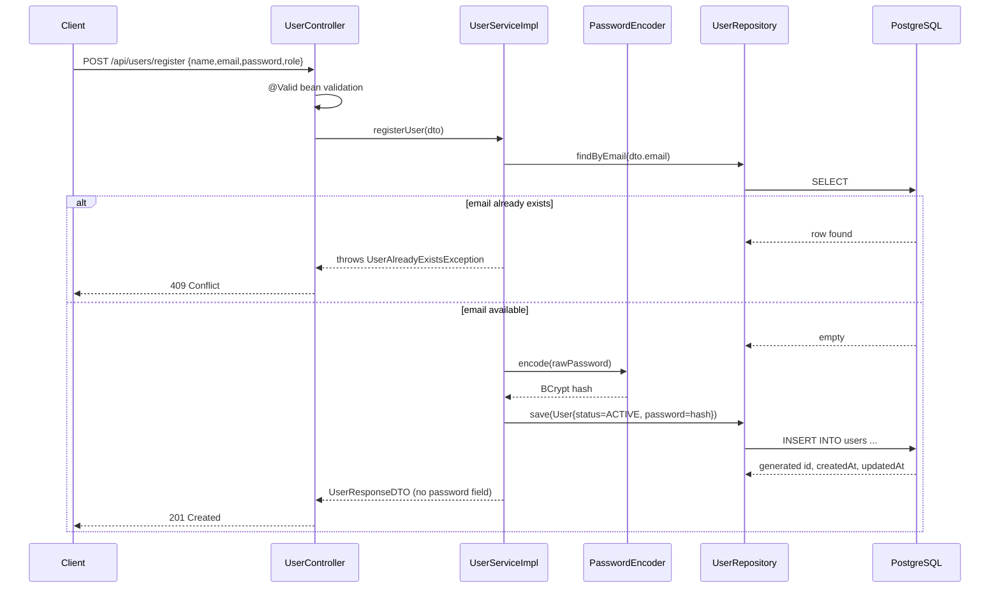
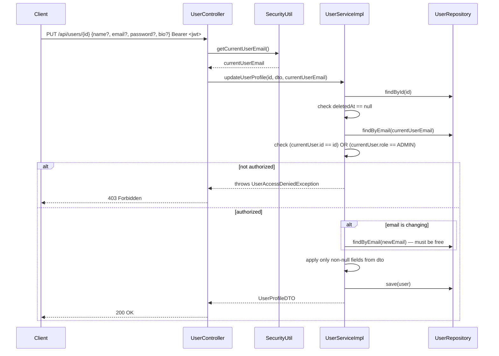

# 02 — User Service (Registration, Profile Management, Soft Delete)

> Prerequisite: `00-OVERVIEW-AND-ARCHITECTURE.md` (especially §4 Guard Block, §5.2 Soft Delete). Related: `01-AUTH-SERVICE.md` for how a user later logs in with the credentials created here.

---

## 1. Purpose & Responsibility

The `user` module owns the `User` entity — the root of almost every relationship in the system (a `User` owns workspaces, sends messages, reports issues, leads projects, etc.). Its responsibilities are narrow and deliberately kept separate from `auth`:

- **Registration** — create a brand-new account (public endpoint, no login required).
- **Profile read/update** — view and edit one's own (or, if admin, anyone's) profile.
- **Account deletion** — soft-delete an account.

It explicitly does **not** handle login (`auth` module) or admin-only operations like banning (`admin` module), even though both of those modules depend heavily on the `User` entity and `UserRepository` defined here.

## 2. Package Structure

```
user/
 ├── controller/
 │    └── UserController.java     → /api/users/register, /api/users/{id}
 ├── dto/
 │    ├── UserRequestDTO.java      → registration input
 │    ├── UserUpdateDTO.java       → profile update input
 │    ├── UserResponseDTO.java     → registration output
 │    └── UserProfileDTO.java      → profile read/update output (includes lastLoginAt)
 ├── entity/
 │    ├── User.java
 │    ├── Role.java                → USER, ADMIN
 │    └── UserStatus.java          → ACTIVE, INACTIVE, BANNED
 ├── repository/
 │    └── UserRepository.java
 └── service/
      ├── UserService.java
      └── UserServiceImpl.java
```

---

## 3. The `User` Entity

```java
@Entity
@Table(name = "users")
@Data
@NoArgsConstructor @AllArgsConstructor @Builder
public class User {

    @Id
    @GeneratedValue(strategy = GenerationType.IDENTITY)
    private Long id;

    @Column(nullable = false)
    private String name;

    @Column(nullable = false, unique = true)
    private String email;

    @Column(nullable = false)
    private String password;               // BCrypt hash — never plaintext

    @Enumerated(EnumType.STRING)
    @Column(nullable = false)
    private Role role;                     // USER | ADMIN

    @Enumerated(EnumType.STRING)
    @Column(nullable = false)
    @Builder.Default
    private UserStatus status = UserStatus.ACTIVE;   // ACTIVE | INACTIVE | BANNED

    @Column(length = 500)
    private String bio;

    private LocalDateTime lastLoginAt;

    @Column(name = "deleted_at")
    private LocalDateTime deletedAt;       // soft-delete marker

    @CreationTimestamp
    @Column(updatable = false)
    private LocalDateTime createdAt;

    @UpdateTimestamp
    private LocalDateTime updatedAt;
}
```

**Annotation-by-annotation:**

| Annotation | Meaning |
|---|---|
| `@Entity` | Tells Hibernate/JPA this class maps to a database table. |
| `@Table(name = "users")` | Explicit table name (rather than defaulting to the class name `User`, which is a reserved word conflict risk in some SQL dialects — `USER` is actually a reserved keyword in PostgreSQL/ANSI SQL, so pluralizing to `users` sidesteps that entirely). |
| `@Id` + `@GeneratedValue(strategy = GenerationType.IDENTITY)` | Primary key, auto-incremented by the database itself (`SERIAL`/`BIGSERIAL` in Postgres) — the simplest and most portable ID generation strategy for a single-database deployment. |
| `@Column(nullable = false, unique = true)` on `email` | Two database-level constraints: `NOT NULL` and a `UNIQUE` index. This is a **safety net**, not the primary duplicate-check mechanism — the primary check is the explicit `userRepository.findByEmail(...).isPresent()` guard in the service (see §5), which lets the app return a clean `409 Conflict` with a friendly message instead of letting a raw database constraint-violation exception bubble up. |
| `@Enumerated(EnumType.STRING)` on `role`/`status` | Stores the enum's *name* (`"ADMIN"`, `"BANNED"`) as text in the database, not its ordinal integer position. **This is important and deliberate**: if you stored ordinals and later inserted a new enum constant in the middle of the list, every existing row's meaning would silently shift. Storing the string name is immune to reordering and is also human-readable when inspecting the database directly. |
| `@Builder.Default private UserStatus status = UserStatus.ACTIVE` | Without `@Builder.Default`, Lombok's `@Builder` would silently override this field to `null` for any object built via `User.builder()...build()` that doesn't explicitly call `.status(...)`. This annotation preserves the sensible default ("every new user starts ACTIVE") when using the builder pattern. |
| `@CreationTimestamp` / `@UpdateTimestamp` | Hibernate-managed columns — automatically set to "now" on insert / on every update, respectively. No manual code anywhere sets these; Hibernate intercepts the `INSERT`/`UPDATE` and populates them. |
| `deletedAt` (no special annotation beyond `@Column`) | A plain nullable timestamp column. `null` = active account, non-null = soft-deleted. This is the field the guard block (overview §4) checks on every request. |

---

## 4. `Role` and `UserStatus` Enums

```java
public enum Role { USER, ADMIN }
public enum UserStatus { ACTIVE, INACTIVE, BANNED }
```

- **`Role`** is the *global, platform-wide* permission level. `ADMIN` unlocks the entire `admin` module (see `09-ADMIN-SERVICE.md`) and also grants bypass privileges in a few workspace-ownership checks (e.g. `WorkspaceServiceImpl.isOwnerOrAdmin()`).
- **`UserStatus`** is the account's *lifecycle* state:
  - `ACTIVE` — normal, fully-functional account.
  - `INACTIVE` — set automatically when a user soft-deletes their own account (see §7). Not currently used as an input state anywhere else (there's no "deactivate but don't delete" flow distinct from soft-delete) — it functions as a synonym for "soft-deleted" in this codebase's current implementation.
  - `BANNED` — set only by an admin (`AdminServiceImpl.banUser()`). Blocks all write actions across every module via the guard block, without erasing any data.

---

## 5. `UserServiceImpl.registerUser()` — Registration Logic

```java
@Override
public UserResponseDTO registerUser(UserRequestDTO dto) {
    if (userRepository.findByEmail(dto.getEmail()).isPresent()) {
        throw new UserAlreadyExistsException("Email already registered");
    }

    String encodedPassword = passwordEncoder.encode(dto.getPassword());

    User user = User.builder()
            .name(dto.getName())
            .email(dto.getEmail())
            .password(encodedPassword)
            .role(dto.getRole())
            .status(UserStatus.ACTIVE)
            .build();

    User savedUser = userRepository.save(user);

    return UserResponseDTO.builder()
            .id(savedUser.getId()).name(savedUser.getName())
            .email(savedUser.getEmail()).bio(savedUser.getBio())
            .role(savedUser.getRole()).status(savedUser.getStatus())
            .createdAt(savedUser.getCreatedAt()).updatedAt(savedUser.getUpdatedAt())
            .build();
}
```

1. **Duplicate email check first** — an explicit `SELECT` before the `INSERT`, so the failure mode is a clean, predictable `409 Conflict` with a helpful message rather than a raw `DataIntegrityViolationException` from the database's unique constraint (which would otherwise fall through to the generic `500` handler in `GlobalExceptionHandler`).
2. **`passwordEncoder.encode(...)`** hashes the plaintext password with BCrypt (including a random salt baked into the resulting hash string) *before* it ever touches the database. The raw password from the request is never persisted or logged.
3. **Builder pattern for entity construction** (`User.builder()...`) — reads clearly at the call site about which field is which, compared to a long positional constructor.
4. **Note the interesting design choice: `role` is taken directly from the client-submitted `UserRequestDTO`.** `@NotNull` on `UserRequestDTO.role` makes the client *required* to specify `USER` or `ADMIN` at registration time. There is no server-side restriction preventing a public, unauthenticated caller from registering themselves directly as `ADMIN`. This is worth flagging explicitly as a **security consideration**: in a production system, you would typically either (a) hardcode `role = USER` server-side for the public registration endpoint and provision admins through a separate, protected flow, or (b) require an existing admin to invite/promote new admins. As written, `POST /api/users/register` with `{"role":"ADMIN", ...}` in the body is honored as-is. This is exactly the kind of detail worth calling out when reviewing or extending this codebase.
5. **The response DTO deliberately omits `password`.** Compare the fields on `UserResponseDTO` to `User` — there is no getter/field for the password hash anywhere in the DTO, so it's structurally impossible for `registerUser()` to leak it, even by accident.

---

## 6. Profile Read & Update — Authorization Model

Both `getUserProfile()` and `updateUserProfile()` share an identical authorization shape:

```java
User currentUser = userRepository.findByEmail(currentUserEmail)
        .orElseThrow(() -> new UserNotFoundException("Current user not found"));

if (!currentUser.getRole().equals(Role.ADMIN) && !currentUser.getId().equals(userId)) {
    throw new UserAccessDeniedException("You don't have permission to view this profile");
}
```

**Rule, in plain English:** *"You may act on a profile if you are that person, OR you are a platform ADMIN."* This single `if` condition is the entire authorization model for the `user` module — no other role checks exist. It's a clean example of the "authorization in code, not annotations" philosophy from the overview (§5.4): the rule references *two different actors* (`currentUser` and the profile-owner identified by `userId`) and a boolean OR between them, which would be awkward to express as a single declarative annotation but reads naturally as an `if`.

### `updateUserProfile()` — field-by-field partial update

```java
if (updateDTO.getEmail() != null && !updateDTO.getEmail().equals(user.getEmail())) {
    if (userRepository.findByEmail(updateDTO.getEmail()).isPresent()) {
        throw new UserAlreadyExistsException("Email already in use");
    }
    user.setEmail(updateDTO.getEmail());
}
if (updateDTO.getName() != null)     user.setName(updateDTO.getName());
if (updateDTO.getPassword() != null) user.setPassword(passwordEncoder.encode(updateDTO.getPassword()));
if (updateDTO.getBio() != null)      user.setBio(updateDTO.getBio());
```

This is a **PATCH-like partial update expressed through PUT** — every field in `UserUpdateDTO` is optional (no `@NotBlank` on `email`, for example), and the service only overwrites a field if the client actually sent a non-null value for it. Omitting a field in the JSON body leaves that column untouched. Two details worth noting:

- **Email uniqueness is re-checked, but only if the email is actually changing** (`!updateDTO.getEmail().equals(user.getEmail())`) — otherwise submitting your own current email back would trip the "already in use" check against yourself.
- **Password is re-hashed on every update that includes one** — never stored or compared as plaintext at any point in this flow either.

---

## 7. `deleteUser()` — Soft Delete in Practice

```java
@Override
public void deleteUser(Long userId, String currentUserEmail) {
    User user = userRepository.findById(userId)
            .orElseThrow(() -> new UserNotFoundException("User not found"));

    if (user.getDeletedAt() != null) {
        throw new UserNotFoundException("User not found");
    }
    // ... same "self or admin" permission check as above ...

    user.setStatus(UserStatus.INACTIVE);
    user.setDeletedAt(LocalDateTime.now());
    userRepository.save(user);
}
```

Notice this is **not** `userRepository.delete(user)`. It's a plain `UPDATE` that sets two columns. Referencing overview §5.2: the `User` row must survive because it's the target of `nullable = false` foreign keys all over the schema (`Channel.creator`, `Message.sender`, `Issue.reporter`, `Workspace.owner`, etc.) — hard-deleting it would either throw a foreign-key-constraint violation or silently orphan historical data. By flipping `status → INACTIVE` and stamping `deletedAt`, every subsequent guard-block check across every other module (overview §4) automatically starts rejecting this account, without touching a single row anywhere else in the database.

**A subtle detail:** if `deleteUser()` is called twice on the same user, the *second* call is rejected with `UserNotFoundException("User not found")` (the `deletedAt != null` check), even though the row still physically exists — from the API's perspective, a soft-deleted user is indistinguishable from a nonexistent one.

---

## 8. `UserController` — Endpoint Reference

| Method | Path | Auth Required | Who Can Call | Purpose |
|---|---|---|---|---|
| `POST` | `/api/users/register` | No (public, listed in `SecurityConfig.permitAll()`) | Anyone | Create a new account |
| `GET` | `/api/users/{id}` | Yes | Self or ADMIN | View a profile |
| `PUT` | `/api/users/{id}` | Yes | Self or ADMIN | Update a profile |
| `DELETE` | `/api/users/{id}` | Yes | Self or ADMIN | Soft-delete an account |

All authenticated endpoints follow the exact controller pattern seen throughout the codebase:

```java
@GetMapping("/{id}")
public ResponseEntity<UserProfileDTO> getUserProfile(@PathVariable Long id) {
    String currentUserEmail = SecurityUtil.getCurrentUserEmail();
    UserProfileDTO profileDTO = userService.getUserProfile(id, currentUserEmail);
    return ResponseEntity.ok(profileDTO);
}
```

The controller is intentionally "thin" — one line to identify the caller, one line to delegate to the service, one line to wrap the result. All the actual decision-making (does this profile exist? is it soft-deleted? is the caller allowed to see it?) lives in `UserServiceImpl`, consistent with the layered architecture described in the overview (§3).

---

## 9. Registration Workflow — Sequence Diagram



## 10. Profile Update Workflow — Sequence Diagram



---

## 11. FAQ / Things You Should Be Able to Answer

**Q: Why is there both a `UserResponseDTO` and a `UserProfileDTO` that look almost identical?**
A: `UserResponseDTO` is the shape returned by *registration*. `UserProfileDTO` is the shape returned by *profile read/update* and additionally includes `lastLoginAt` — information that's irrelevant at registration time (a brand-new user has never logged in) but meaningful once a profile is being viewed. Keeping them as separate classes, even with overlapping fields, means each endpoint's contract can evolve independently without accidentally changing the other's shape.

**Q: Can a regular `USER` view another regular user's profile?**
A: No. The rule is strictly "self, or ADMIN". There's no concept of "public profile visible to workspace members" in this module — visibility of *who's in a workspace* is a separate, distinct feature handled entirely by the `workspace` module's member-listing endpoints (see `03-WORKSPACE-SERVICE.md`), which return a much smaller `WorkspaceMemberDTO`/`UserBasicInfoDTO`, not the full profile.

**Q: What actually happens in the database when I "delete" my account?**
A: Nothing is removed. Two columns on your existing row are updated: `status` becomes `'INACTIVE'` and `deleted_at` gets the current timestamp. All your historical messages, issues, and channel memberships remain exactly as they were, still pointing at your (now-inactive) user row.

**Q: If I delete my account, can I register again with the same email?**
A: No — `findByEmail` in the duplicate-check at registration does not filter out soft-deleted accounts, so the unique email constraint still blocks a second registration with that address. (Note there is a separate, unused repository method `findActiveUserByEmail` that *does* filter by `deletedAt IS NULL`; it isn't wired into the registration duplicate-check today, but its presence hints at where you'd plug in "allow re-registration after soft-delete" behavior if that were a desired feature.)

**Q: Is there anything stopping someone from registering themselves as an `ADMIN`?**
A: Not in the current implementation — see §5, point 4. This is a known gap worth flagging in a security review.
