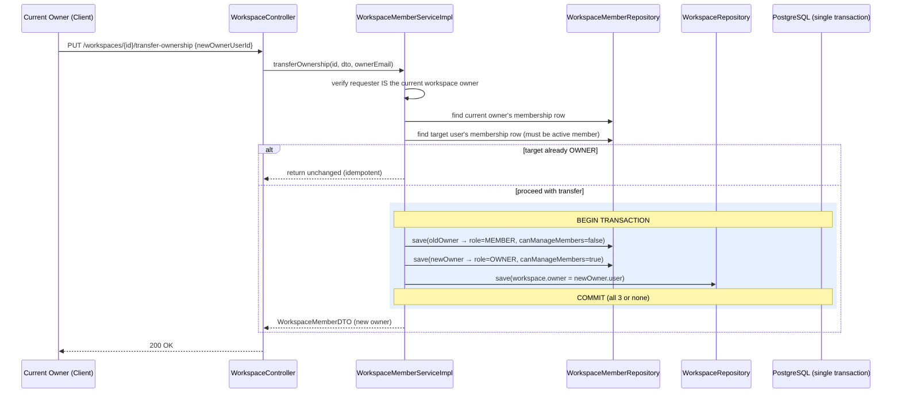
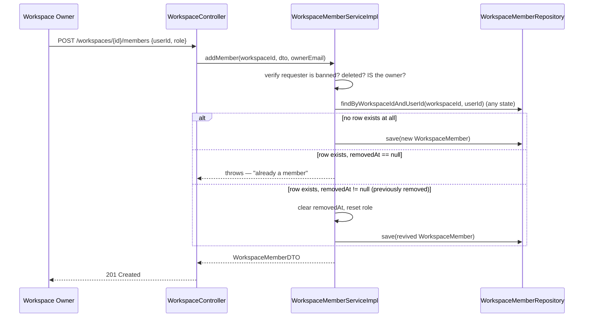

# 03 — Workspace Service (Workspaces, Membership, Ownership Transfer)

> Prerequisite: `00-OVERVIEW-AND-ARCHITECTURE.md` (§4 Guard Block, §5.3 two role systems, §5.6 `@Transactional`). This is the **tenant-boundary module** — nearly every other module's authorization logic ultimately calls into `WorkspaceMemberRepository` defined here.

---

## 1. Purpose & Responsibility

A `Workspace` is CollabHub's equivalent of a Slack "team" or a Jira "site" — the top-level container everything else lives inside. This module owns:

- **Workspace CRUD** — create, read, update, delete.
- **Membership management** — inviting/removing members, listing members.
- **Ownership transfer** — handing the "OWNER" role from one member to another.
- **Suspension support (data side)** — the `Workspace.suspended` flag lives here, though only the `admin` module can flip it (see `09-ADMIN-SERVICE.md`).

Two separate services exist because these are two distinct concerns: `WorkspaceService` manages the workspace *record itself*; `WorkspaceMemberService` manages the *join table* between users and workspaces. Splitting them keeps each service focused and avoids one giant class doing everything.

## 2. Package Structure

```
workspace/
 ├── controller/
 │    └── WorkspaceController.java   → all /api/workspaces/** endpoints
 ├── dto/
 │    ├── CreateWorkspaceRequestDTO.java
 │    ├── WorkspaceResponseDTO.java       → includes nested owner + members list
 │    ├── UserBasicInfoDTO.java           → minimal user info embedded in responses
 │    ├── AddWorkspaceMemberDTO.java
 │    ├── WorkspaceMemberDTO.java
 │    └── TransferOwnershipDTO.java
 ├── entity/
 │    ├── Workspace.java
 │    ├── WorkspaceMember.java            → the join table entity
 │    └── WorkspaceRole.java              → MEMBER | OWNER
 ├── repository/
 │    ├── WorkspaceRepository.java
 │    └── WorkspaceMemberRepository.java
 └── service/
      ├── WorkspaceService.java / WorkspaceServiceImpl.java
      └── WorkspaceMemberService.java / WorkspaceMemberServiceImpl.java
```

---

## 3. Entities

### `Workspace`

```java
@Entity
@Table(name = "workspaces")
public class Workspace {
    @Id @GeneratedValue(strategy = GenerationType.IDENTITY)
    private Long id;
    private String name;
    private String description;

    @ManyToOne(fetch = FetchType.EAGER)
    @JoinColumn(name = "owner_id", nullable = false)
    private User owner;

    @Builder.Default
    private Boolean suspended = false;
    private LocalDateTime suspendedAt;
    private String suspensionReason;

    @CreationTimestamp private LocalDateTime createdAt;
    @UpdateTimestamp   private LocalDateTime updatedAt;
}
```

**Why `fetch = FetchType.EAGER` on `owner`, when almost every other `@ManyToOne` in the codebase uses `LAZY`?** Nearly every workspace operation needs the owner's identity immediately (to check "is the caller the owner?" or to populate `owner` in the response DTO). Making it `EAGER` means Hibernate fetches the owner in the same query (a SQL `JOIN`) rather than firing a second lazy-load query the moment `.getOwner()` is called — a deliberate performance/simplicity trade-off for a field that's used on essentially every code path through this entity. (Compare this to `Channel.workspace`, which is `LAZY` because many channel operations don't immediately need the full workspace object.)

### `WorkspaceMember` — the join table, modeled as its own entity (not a raw `@ManyToMany`)

```java
@Entity
@Table(name = "workspace_members", uniqueConstraints = {
        @UniqueConstraint(columnNames = {"workspace_id", "user_id"})
})
public class WorkspaceMember {
    @Id @GeneratedValue(strategy = GenerationType.IDENTITY)
    private Long id;

    @ManyToOne(fetch = FetchType.EAGER) @JoinColumn(name = "workspace_id", nullable = false)
    private Workspace workspace;

    @ManyToOne(fetch = FetchType.EAGER) @JoinColumn(name = "user_id", nullable = false)
    private User user;

    @Enumerated(EnumType.STRING) @Builder.Default
    private WorkspaceRole role = WorkspaceRole.MEMBER;

    @Builder.Default
    private Boolean canManageMembers = false;

    @CreationTimestamp private LocalDateTime joinedAt;
    private LocalDateTime removedAt;   // soft delete — null = still a member
}
```

**Why a full entity instead of Hibernate's built-in `@ManyToMany`?** A plain `@ManyToMany` between `User` and `Workspace` would only let you model "is a member of" as a boolean fact — you couldn't attach *extra data* to that relationship, like `role`, `canManageMembers`, `joinedAt`, or `removedAt`. Whenever a many-to-many relationship needs its own attributes, the standard JPA pattern is exactly this: **demote it to a proper entity with a composite uniqueness constraint** (`@UniqueConstraint(columnNames = {"workspace_id", "user_id"})` — the database itself guarantees a user can't have two active membership rows in the same workspace at the schema level, complementing the application-level checks in the service).

**Soft delete again:** `removedAt` follows the exact same pattern as `User.deletedAt` (overview §5.2) — removing a member never deletes the row (it might be needed for audit history, and re-adding a previously-removed member is explicitly supported, see §5), it just stamps a timestamp.

### `WorkspaceRole`

```java
public enum WorkspaceRole { MEMBER, OWNER }
```

Deliberately just two values (no `ADMIN`-within-a-workspace, no fine-grained permission tiers). `canManageMembers` on `WorkspaceMember` is a separate boolean flag rather than a third role — currently it's always set equal to `(role == OWNER)` everywhere it's assigned, so in practice it's redundant with the role today, but it exists as a hook for future fine-grained permission models (e.g. a `MEMBER` who is specifically granted member-management rights without full ownership) without requiring a schema migration.

---

## 4. `WorkspaceServiceImpl` — Workspace CRUD

### `createWorkspace()`

```java
User owner = userRepository.findByEmail(ownerEmail).orElseThrow(...);
if (owner.getDeletedAt() != null) throw new UserNotFoundException(...);
if (UserStatus.BANNED.equals(owner.getStatus())) throw new UserBannedException(...);

if (workspaceRepository.findByNameAndOwnerId(request.getName(), owner.getId()).isPresent())
    throw new IllegalArgumentException("Workspace with name '...' already exists");

Workspace workspace = Workspace.builder().name(...).description(...).owner(owner).build();
Workspace savedWorkspace = workspaceRepository.save(workspace);

WorkspaceMember ownerMember = WorkspaceMember.builder()
        .workspace(savedWorkspace).user(owner)
        .role(WorkspaceRole.OWNER).canManageMembers(true)
        .build();
memberRepository.save(ownerMember);
```

Two important design points:

1. **Uniqueness scope: name is unique *per owner*, not globally.** `findByNameAndOwnerId` means two different users can each have a workspace called `"Engineering"` — the constraint only prevents *the same user* from creating two identically-named workspaces. This matches how most SaaS products work (workspace names are meaningful to their creator, not globally reserved).
2. **Every workspace creation is really two writes: the `Workspace` row, and a `WorkspaceMember` row for the owner.** This is the mechanism referenced in the entity comment ("When a workspace is created, the creator is automatically OWNER... OWNER will also be added as a member"). This keeps `Workspace.owner` and the `WorkspaceMember` membership list *always consistent* — the owner is never "invisible" from the member-listing endpoints, because they're a real row in `workspace_members` from the moment the workspace exists, not just an implicit fact derivable from `Workspace.owner`.

### `getUserWorkspaces()` — different results depending on role

```java
if (Role.ADMIN.equals(user.getRole())) {
    return workspaceRepository.findAll().stream().map(this::convertToResponseDTO)...;
}
// else: combine workspaces where user is a member, plus workspaces user owns (dedup)
```

An `ADMIN` calling `GET /api/workspaces` sees **every workspace in the system**, while a regular `USER` sees only workspaces they belong to (as owner or member). This is a good concrete illustration of the two-role-system point from the overview (§5.3): the *global* `Role.ADMIN` grants a platform-wide superpower even inside an endpoint that's nominally about "my workspaces".

The regular-user branch explicitly unions two lists (member-of + owned-by) and de-duplicates by ID:

```java
List<Workspace> allUserWorkspaces = new ArrayList<>(memberWorkspaces);
ownedWorkspaces.forEach(owned -> {
    if (!allUserWorkspaces.stream().anyMatch(w -> w.getId().equals(owned.getId()))) {
        allUserWorkspaces.add(owned);
    }
});
```

In practice, since the owner is *always* also inserted as a `WorkspaceMember` at creation time (§4 above), these two lists should already fully overlap for workspaces created through the normal flow — this defensive union guards against any edge case where that invariant might not hold (e.g. data created by other means, or a future code path that creates a `Workspace` without the matching membership row).

### `updateWorkspace()` / `deleteWorkspace()` — the `isOwnerOrAdmin()` gate

```java
private boolean isOwnerOrAdmin(User user, Workspace workspace) {
    if (Role.ADMIN.equals(user.getRole())) return true;
    return workspace.getOwner().getId().equals(user.getId());
}
```

Both mutation methods call this before proceeding, and both also re-check `workspace.getSuspended()` first and reject with `WorkspaceSuspendedException` if true — **a suspended workspace cannot even be modified or deleted by its own owner**, only an admin can lift the suspension (`09-ADMIN-SERVICE.md`).

**`deleteWorkspace()` is a genuine hard delete**, unlike `User`:

```java
List<WorkspaceMember> members = memberRepository.findByWorkspaceId(workspaceId);
memberRepository.deleteAll(members);
workspaceRepository.deleteById(workspaceId);
```

Membership rows are explicitly deleted first, then the workspace itself. This is a manual cascade — there's no `cascade = CascadeType.REMOVE` on the entity mapping, so the code performs the cleanup itself. (Deleting channels/projects that reference this workspace isn't shown here; in practice those tables have `nullable = false` foreign keys to `workspace_id`, so a full production cleanup would need to cascade through those too — worth checking your database's `ON DELETE` behavior or extending this method if you exercise this path with existing channels/projects.)

---

## 5. `WorkspaceMemberServiceImpl` — Membership Management

### `addMember()` — including the "restore a previously removed member" branch

```java
if (!workspace.getOwner().getId().equals(requester.getId()))
    throw new UserAccessDeniedException("Only the workspace owner can add members");

Optional<WorkspaceMember> existingMember =
        memberRepository.findByWorkspaceIdAndUserId(workspaceId, request.getUserId());  // note: NOT the ...AndRemovedAtIsNull variant

if (existingMember.isPresent()) {
    WorkspaceMember member = existingMember.get();
    if (member.getRemovedAt() == null) {
        throw new UserAccessDeniedException("User is already a member of this workspace");
    }
    // Restore soft-deleted member
    member.setRemovedAt(null);
    member.setRole(role);
    member.setCanManageMembers(role == WorkspaceRole.OWNER);
    memberRepository.save(member);
    return convertToDTO(member);
}
// else: create brand-new WorkspaceMember row
```

This is a nice example of correctly handling the soft-delete pattern's edge case: because the entity has a `@UniqueConstraint(workspace_id, user_id)`, you **cannot** simply insert a brand-new `WorkspaceMember` row for a user who was previously removed — the unique constraint would reject it at the database level, since their old (soft-deleted) row still occupies that `(workspace_id, user_id)` pair. The code correctly checks for *any* existing row (`findByWorkspaceIdAndUserId`, without the `RemovedAtIsNull` filter) and, if found in a removed state, **revives it** by clearing `removedAt` rather than trying to insert a duplicate. If you only remembered `findByWorkspaceIdAndUserIdAndRemovedAtIsNull` existed, you might think "add a previously-removed user" would either silently fail or throw a mysterious constraint-violation `500` — the fact that this codebase explicitly branches on this case shows careful handling of soft-delete's downstream implications.

Only the **workspace owner** can add members — notice this is *not* "owner or admin" here, unlike `updateWorkspace`/`deleteWorkspace`. Membership management is treated as a stricter, owner-only operation even for platform admins (an admin can still suspend the whole workspace via the `admin` module if truly necessary, but day-to-day membership is left to the workspace's own owner).

### `removeMember()` — protecting the owner from self-removal

```java
if (workspace.getOwner().getId().equals(userId)) {
    throw new UserAccessDeniedException("Owner cannot remove themselves. Transfer ownership first.");
}
```

This prevents a workspace from ever ending up ownerless. It forces a deliberate two-step process (transfer ownership, *then* the former owner — now a regular `MEMBER` — could theoretically be removed by the new owner) rather than allowing an accidental "orphaned workspace" state.

### `transferOwnership()` — the module's one `@Transactional` write with multiple entities

```java
@Override
@Transactional
public WorkspaceMemberDTO transferOwnership(Long workspaceId, TransferOwnershipDTO request, String requesterEmail) {
    ...
    if (!workspace.getOwner().getId().equals(requester.getId()))
        throw new UserAccessDeniedException("Only owner can transfer ownership");

    if (requester.getId().equals(newOwnerUserId))
        throw new IllegalArgumentException("You are already the owner");

    WorkspaceMember currentOwnerMember = memberRepository.findByWorkspaceIdAndUserIdAndRemovedAtIsNull(workspaceId, requester.getId())...;
    WorkspaceMember newOwnerMember = memberRepository.findByWorkspaceIdAndUserIdAndRemovedAtIsNull(workspaceId, newOwnerUserId)
            .orElseThrow(() -> new UserNotFoundException("Target user is not a member of this workspace"));

    if (newOwnerMember.getRole() == WorkspaceRole.OWNER) {
        return convertToDTO(newOwnerMember); // idempotent: already the owner
    }

    currentOwnerMember.setRole(WorkspaceRole.MEMBER);
    currentOwnerMember.setCanManageMembers(false);
    newOwnerMember.setRole(WorkspaceRole.OWNER);
    newOwnerMember.setCanManageMembers(true);
    workspace.setOwner(newOwnerMember.getUser());

    memberRepository.save(currentOwnerMember);
    memberRepository.save(newOwnerMember);
    workspaceRepository.save(workspace);

    return convertToDTO(newOwnerMember);
}
```

This is the canonical example the overview (§5.6) points to for **why `@Transactional` matters**. Three separate writes must succeed together:

1. Demote the old owner's `WorkspaceMember.role` to `MEMBER`.
2. Promote the new owner's `WorkspaceMember.role` to `OWNER`.
3. Update `Workspace.owner` itself to point at the new user.

If the process crashed between steps 2 and 3 *without* a transaction wrapping them, you'd end up with a `WorkspaceMember` row claiming `role = OWNER` for the new user, while `Workspace.owner` still points at the old user — two different, contradictory sources of truth (remember, ownership is represented *twice* in this schema, as noted in the overview's ER diagram section). `@Transactional` guarantees these three `save()` calls are committed as a single atomic unit; any exception thrown partway through rolls all three back, so the database is never left in that inconsistent state.

The target user must **already be an active member** (`findByWorkspaceIdAndUserIdAndRemovedAtIsNull`, throwing if absent) — you cannot transfer ownership to someone who hasn't been added to the workspace first. And the idempotency check (`if (newOwnerMember.getRole() == WorkspaceRole.OWNER) return ...`) gracefully handles a duplicate/retried request without throwing an error.

---

## 6. `WorkspaceController` — Endpoint Reference

| Method | Path | Who Can Call | Purpose |
|---|---|---|---|
| `POST` | `/api/workspaces` | Any authenticated active, non-banned user | Create workspace (caller becomes owner) |
| `GET` | `/api/workspaces` | Any authenticated user | List workspaces you belong to (or all, if ADMIN) |
| `GET` | `/api/workspaces/{id}` | Any authenticated user* | Get one workspace's details |
| `PUT` | `/api/workspaces/{id}` | Owner or ADMIN | Update name/description |
| `DELETE` | `/api/workspaces/{id}` | Owner or ADMIN | Hard-delete workspace + its memberships |
| `POST` | `/api/workspaces/{workspaceId}/members` | Workspace owner only | Add/invite a member |
| `GET` | `/api/workspaces/{workspaceId}/members` | Any active member of that workspace | List members |
| `GET` | `/api/workspaces/{workspaceId}/members/{userId}` | Any active member of that workspace | Get one member's details |
| `PUT` | `/api/workspaces/{workspaceId}/transfer-ownership` | Current owner only | Transfer ownership to another member |
| `DELETE` | `/api/workspaces/{workspaceId}/members/{userId}` | Workspace owner only | Remove a member (soft delete) |

\* `getWorkspaceById()` deliberately does **not** require workspace membership — see the code comment in `WorkspaceServiceImpl`: *"Any authenticated user can view any workspace"*. Only its finer-grained children (channels, projects, members) are membership-gated. This might look surprising at first, but it means, for example, an invite flow could show a non-member basic workspace info (name, description) as a preview before they join — while all the *interesting* content underneath stays properly locked down.

---

## 7. Ownership Transfer Workflow — Sequence Diagram



## 8. Add-Member Workflow (Including Soft-Delete Revival) — Sequence Diagram



---

## 9. FAQ / Things You Should Be Able to Answer

**Q: Why does `WorkspaceMember` exist as a full `@Entity` instead of a simple `@ManyToMany` set on `User`/`Workspace`?**
A: Because the relationship itself carries data — `role`, `canManageMembers`, `joinedAt`, `removedAt` — that a bare many-to-many join table can't hold. Whenever a relationship needs its own attributes, it graduates to a first-class entity.

**Q: Is `Workspace.owner` or the `WorkspaceMember` row with `role = OWNER` the "real" source of truth for who owns a workspace?**
A: Both are meant to always agree — they're kept in sync deliberately (see `createWorkspace()` and `transferOwnership()`, both of which write to both places inside the same operation/transaction). Most authorization checks (`isOwnerOrAdmin`, `isChannelOwner`, etc.) actually read `Workspace.owner` directly since it's a single, `EAGER`-loaded field with no extra query needed.

**Q: Can a workspace ever end up with zero owners?**
A: No — `removeMember()` explicitly blocks the owner from removing themselves, and there's no code path that deletes the owner's `WorkspaceMember` row without also reassigning `Workspace.owner` first via `transferOwnership()`.

**Q: I removed a member, then tried to add them back — will that fail because of the unique constraint?**
A: No. `addMember()` explicitly detects a previously-removed row for that `(workspace, user)` pair and revives it (clears `removedAt`) instead of attempting a duplicate insert.

**Q: Who can see a workspace's basic details (name/description) — does a caller need to be a member?**
A: No — `getWorkspaceById()` is open to any authenticated user, active-workspace-only (rejects if suspended). Membership is required for the *members list*, not for the workspace summary itself.

**Q: What stops a random `USER` (non-admin, non-owner) from deleting someone else's workspace?**
A: `deleteWorkspace()` calls `isOwnerOrAdmin(user, workspace)` and throws `IllegalArgumentException` (mapped to a generic error, not currently one of the specifically-typed exceptions with its own HTTP status mapping) if that check fails.
