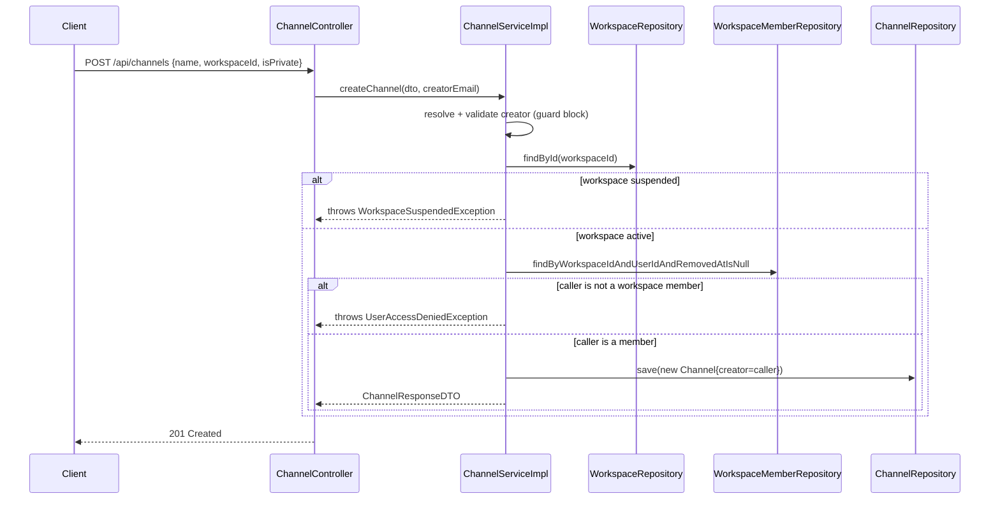
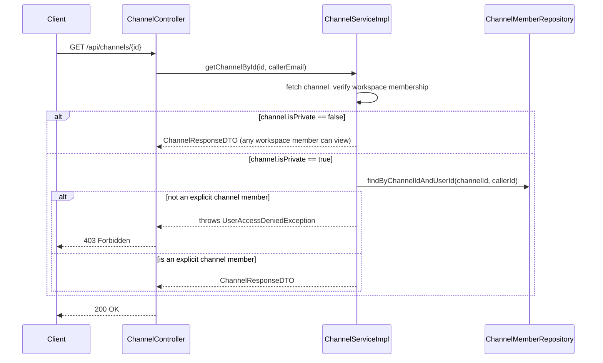

# 04 — Channel Service (Channels & Channel Membership)

> Prerequisite: `00-OVERVIEW-AND-ARCHITECTURE.md` and `03-WORKSPACE-SERVICE.md` (channels live inside workspaces and reuse the same membership philosophy). Related: `05-MESSAGE-AND-REALTIME-SERVICE.md` — channels are where messages live.

---

## 1. Purpose & Responsibility

A `Channel` is a Slack-style conversation space that lives inside exactly one `Workspace`. This module owns:

- **Channel CRUD** — create, read, update (rename/description/privacy), delete.
- **Channel membership** — a *separate* concept from workspace membership: being a workspace member does not automatically make you a member of every channel in it (private channels in particular require explicit membership).

## 2. Package Structure

```
channel/
 ├── controller/
 │    └── ChannelController.java
 ├── dto/
 │    ├── CreateChannelDTO.java, UpdateChannelDTO.java
 │    ├── ChannelResponseDTO.java        → includes memberCount
 │    ├── AddChannelMemberDTO.java
 │    └── ChannelMemberResponseDTO.java
 ├── entity/
 │    ├── Channel.java
 │    └── ChannelMember.java             → join table entity (mirrors WorkspaceMember's pattern)
 ├── repository/
 │    ├── ChannelRepository.java
 │    └── ChannelMemberRepository.java
 └── service/
      ├── ChannelService.java / ChannelServiceImpl.java
      └── ChannelMemberService.java / ChannelMemberServiceImpl.java
```

---

## 3. Entities

### `Channel`

```java
@Entity
@Table(name = "channels")
public class Channel {
    @Id @GeneratedValue(strategy = GenerationType.IDENTITY)
    private Long id;

    @Column(nullable = false)
    private String name;
    private String description;

    @Builder.Default
    private Boolean isPrivate = false;

    @ManyToOne(fetch = FetchType.LAZY) @JoinColumn(name = "workspace_id", nullable = false)
    private Workspace workspace;

    @ManyToOne(fetch = FetchType.LAZY) @JoinColumn(name = "creator_id", nullable = false)
    private User creator;

    @CreationTimestamp private LocalDateTime createdAt;
    @UpdateTimestamp   private LocalDateTime updatedAt;
}
```

Both `workspace` and `creator` are `FetchType.LAZY` here — unlike `Workspace.owner` (`EAGER`, see `03-WORKSPACE-SERVICE.md` §3). The reasoning is symmetrical: most channel *list* operations (e.g. "give me all channels in this workspace") don't need to re-fetch the full `Workspace` object for every single channel row (you already know the workspace — you're querying *by* it), so `LAZY` avoids that redundant work. Where the code *does* need the workspace object (e.g. to check `workspace.getSuspended()`), it explicitly loads it via `workspaceRepository.findById(...)` rather than relying on lazy-triggering `channel.getWorkspace()`.

### `ChannelMember`

```java
@Entity
@Table(name = "channel_members", uniqueConstraints = {
        @UniqueConstraint(columnNames = {"channel_id", "user_id"})
})
public class ChannelMember {
    @Id @GeneratedValue(strategy = GenerationType.IDENTITY)
    private Long id;
    @ManyToOne @JoinColumn(name = "channel_id", nullable = false) private Channel channel;
    @ManyToOne @JoinColumn(name = "user_id", nullable = false)    private User user;
    @CreationTimestamp private LocalDateTime joinedAt;
}
```

Structurally identical in spirit to `WorkspaceMember` (a join entity with a composite unique constraint), but **notably simpler** — no `role`, no `removedAt`. Channel membership in this codebase is a binary, permanently-recorded fact: you're a member or you're not, and "removing" a member is implemented as `channelMemberRepository.delete(member)` — a genuine hard delete of the join row, not a soft delete. This is a reasonable design choice: unlike `User` or `WorkspaceMember`, a `ChannelMember` row is *just* a membership marker with no other data depending on it (messages reference `sender`, a `User`, directly — not through `ChannelMember`), so there's nothing to "orphan" by removing it outright.

---

## 4. `ChannelServiceImpl` — Channel CRUD & Authorization

### The shared workspace-membership gate

Every channel operation starts by resolving the workspace and checking the caller is an active member of it:

```java
Workspace workspace = workspaceRepository.findById(dto.getWorkspaceId())
        .orElseThrow(() -> new WorkspaceNotFoundException(...));
if (workspace.getSuspended()) throw new WorkspaceSuspendedException(...);

boolean isMember = workspaceMemberRepository
        .findByWorkspaceIdAndUserIdAndRemovedAtIsNull(workspace.getId(), creator.getId())
        .isPresent();
if (!isMember) throw new UserAccessDeniedException("You must be a workspace member to create a channel");
```

This is the tenant-isolation check from the overview (§4) in action: **a channel cannot exist without its parent workspace's permission boundary being respected first.** This same three-part check (workspace exists → not suspended → caller is a member) appears, nearly verbatim, at the top of `createChannel`, `updateChannel`, and `deleteChannel`.

### `isChannelOwner()` — a second, narrower ownership concept

```java
private boolean isChannelOwner(Channel channel, User user) {
    return channel.getCreator().getId().equals(user.getId());
}
```

For `updateChannel()` and `deleteChannel()`, the rule is: **channel creator, or workspace owner, or platform admin.**

```java
boolean canModify = isChannelOwner(channel, user)
        || channel.getWorkspace().getOwner().getId().equals(user.getId())
        || Role.ADMIN.equals(user.getRole());
if (!canModify) throw new UserAccessDeniedException("You don't have permission to update this channel");
```

This introduces a **third tier of authority**, distinct from both role systems described in the overview (§5.3): "created this specific resource". It's a common pattern worth recognizing — resource creators often retain edit rights over their own creations even without any elevated role, and that right is layered *on top of* (not instead of) the workspace-owner and platform-admin escalation paths. You'll see this exact three-way `||` shape repeated in the `project`, `issue`, and `sprint` modules too, each substituting their own notion of "creator" or "lead".

### `getChannelById()` — private channel visibility

```java
if (channel.getIsPrivate()) {
    boolean isChannelMember = channelMemberRepository
            .findByChannelIdAndUserId(channel.getId(), user.getId()).isPresent();
    if (!isChannelMember) throw new UserAccessDeniedException("This is a private channel...");
}
```

This is the key behavioral difference between public and private channels: **a public channel is visible to anyone who is a member of the parent workspace** (no separate `ChannelMember` row required just to *view* it), but **a private channel additionally requires an explicit `ChannelMember` row.** This mirrors how Slack itself works — public channels are discoverable/joinable by the whole team by default, private channels are invite-only. `getChannelsByWorkspace()` (list endpoint) applies the same filter, so a private channel you're not in simply doesn't appear in your channel list at all — you can't even see that it exists (as opposed to seeing it but being denied access).

### `deleteChannel()` — hard delete, with manual cascade

```java
List<ChannelMember> members = channelMemberRepository.findByChannelId(channelId);
channelMemberRepository.deleteAll(members);
channelRepository.delete(channel);
```

Same manual-cascade style as `WorkspaceServiceImpl.deleteWorkspace()` — membership rows are cleaned up explicitly before the parent row is removed, since there's no `cascade = CascadeType.REMOVE` declared on the JPA mapping.

---

## 5. `ChannelMemberServiceImpl` — Channel Membership

### `addMember()`

```java
if (!channel.getIsPrivate())
    throw new IllegalStateException("Cannot manually add members to a public channel...");
```

**This check is a deliberate and important design decision worth internalizing:** public channels don't have (and don't need) an explicit membership list to *add to* — anyone in the workspace can already see/use them by virtue of workspace membership (per `getChannelById()`'s logic above). Explicit `ChannelMember` rows only make sense — and are only permitted to be created — for **private** channels, where they're the *sole* mechanism controlling access. Attempting to "add a member" to a public channel is therefore treated as a logical error, not a supported operation.

Only the channel creator or the workspace owner may add members (same `isChannelOwner() || workspaceOwner` pattern as above, without the platform-admin branch this time — worth noting the inconsistency: `updateChannel`/`deleteChannel` allow ADMIN bypass, `addMember`/`removeMember` do not).

### `removeMember()`

```java
if (channel.getCreator().getId().equals(userId))
    throw new IllegalStateException("Cannot remove the channel creator from the channel");
```

Same protective pattern as `WorkspaceMemberServiceImpl.removeMember()` blocking self-removal of the owner (§03, "protecting the owner from self-removal") — here applied to the channel creator instead, preventing a private channel from ending up creator-less.

---

## 6. `ChannelController` — Endpoint Reference

| Method | Path | Notes |
|---|---|---|
| `POST` | `/api/channels` | body includes `workspaceId`; creator auto-added as implicit member of their own creation via ownership, not a `ChannelMember` row (creator identity is tracked on `Channel.creator` directly) |
| `GET` | `/api/channels/{id}` | Enforces private-channel visibility |
| `GET` | `/api/channels/my-channels` | All channels (across all workspaces) the caller belongs to |
| `GET` | `/api/channels/workspace/{workspaceId}` | Channels in one workspace, filtered by visibility |
| `PUT` | `/api/channels/{id}` | Creator, workspace owner, or admin |
| `DELETE` | `/api/channels/{id}` | Creator, workspace owner, or admin |
| `POST` | `/api/channels/{channelId}/members` | Private channels only; creator or workspace owner |
| `DELETE` | `/api/channels/{channelId}/members/{userId}` | Private channels only; cannot remove creator |
| `GET` | `/api/channels/{channelId}/members` | List a private channel's explicit members |

---

## 7. Create-Channel Workflow — Sequence Diagram



## 8. Private Channel Visibility Workflow — Sequence Diagram



---

## 9. FAQ / Things You Should Be Able to Answer

**Q: If I'm a member of a workspace, am I automatically a member of every channel in it?**
A: Only *effectively*, for **public** channels (you can view/use them without a `ChannelMember` row, because visibility is derived from workspace membership). For **private** channels, no — you need an explicit `ChannelMember` row, added by the channel creator or workspace owner.

**Q: Why can't I add a member to a public channel?**
A: Because public channel access isn't gated by the `ChannelMember` table at all — it's gated by workspace membership. There's nothing meaningful to "add"; the service explicitly rejects the attempt with `IllegalStateException`.

**Q: Who can rename or delete a channel?**
A: The channel's creator, the workspace's owner, or a platform admin — three independent paths to the same permission, checked with an `||`.

**Q: What happens to channel membership rows when the channel is deleted?**
A: They're explicitly deleted first (`channelMemberRepository.deleteAll(members)`) before the channel row itself is removed — a manual, code-level cascade rather than a database `ON DELETE CASCADE` or JPA `cascade` attribute.

**Q: Can the channel creator ever be removed from their own private channel?**
A: No — `removeMember()` explicitly blocks this, exactly like a workspace owner can't remove themselves without transferring ownership first.
