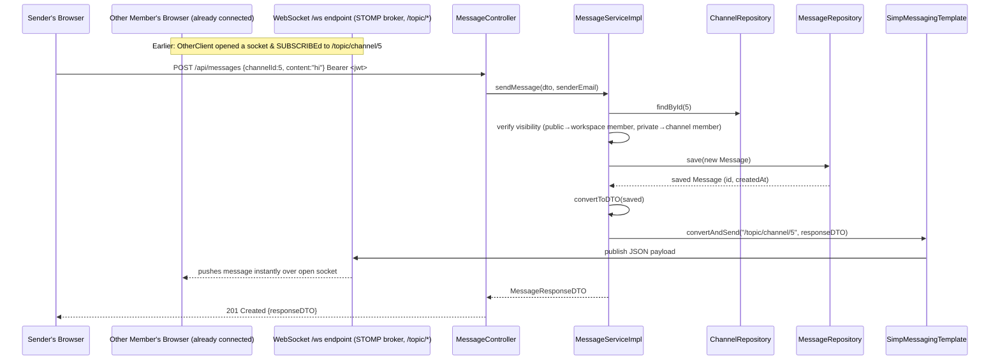

# 05 — Message Service & Real-Time Infrastructure (WebSocket/STOMP)

> Prerequisite: `00-OVERVIEW-AND-ARCHITECTURE.md`, `04-CHANNEL-SERVICE.md`. This doc covers both the `message` module *and* the cross-cutting WebSocket configuration (`config/StompWebSocketConfig.java`, `listener/WebSocketConnectListener.java`), because they only make sense together — messaging is the primary consumer of the real-time layer (the `issue`/`sprint` modules also reuse it for board updates, referenced briefly at the end).

---

## 1. Purpose & Responsibility

The `message` module handles:

- **Sending, editing, deleting messages** inside a channel.
- **Reactions** (emoji) on messages.
- **@Mentions** of other users within a message.
- **Real-time delivery** — the moment a message is created/edited/deleted/reacted-to, every connected client subscribed to that channel receives a push update, without polling.

## 2. Package Structure

```
message/
 ├── controller/MessageController.java
 ├── dto/  SendMessageDTO, MessageResponseDTO, AddReactionDTO, ...
 ├── entity/ Message.java
 ├── repository/MessageRepository.java
 └── service/ MessageService.java / MessageServiceImpl.java

config/
 └── StompWebSocketConfig.java     ← registers the /ws endpoint & message broker
listener/
 └── WebSocketConnectListener.java ← logs socket connect/disconnect events
```

---

## 3. Two Different Communication Styles, Working Together

This is the single most important concept to understand before reading any code: **CollabHub does not send chat messages over the WebSocket.** The actual "create a message" operation is a completely normal, authenticated **REST `POST`** request. The WebSocket is used **only to broadcast the result** to everyone else who's already watching that channel. Put differently:

- **Write path:** `POST /api/messages` (HTTP, JWT-authenticated, goes through the full Spring Security filter chain) → validated, persisted to Postgres → service then **pushes** the saved message onto a STOMP topic.
- **Read/live-update path:** the frontend opens one WebSocket connection per session and `SUBSCRIBE`s to topics like `/topic/channel/{channelId}`. Any message broadcast to that topic arrives instantly in every subscribed browser tab, including the sender's own other tabs and every other member currently online.

**Why split it this way instead of sending messages *through* the socket (e.g. a STOMP `@MessageMapping("/chat.send")` handler)?**

1. **Security simplicity.** The whole JWT + Spring Security machinery (overview §7–8) is built around HTTP requests. Reusing it for the "create" operation means message creation gets the exact same authentication, validation (`@Valid`), and centralized exception handling (`GlobalExceptionHandler`) as every other write in the app, for free. Authenticating individual STOMP frames over a raw socket connection would require a parallel, custom security mechanism.
2. **Consistency with the rest of the API.** Every other module (channels, projects, issues) is pure REST. Keeping message *creation* REST-based means a client library/SDK only needs one request-authentication story for the whole app; the socket is purely a "push notifications" side-channel, not an alternate way to mutate data.
3. **Reliability.** An HTTP `POST` gets a definitive synchronous response (`201 Created` + the saved message, or a clear error) that the sender's own UI can react to immediately, independent of whether their WebSocket connection happens to be healthy at that exact moment. The broadcast to *other* clients is a separate, best-effort concern layered on top.

---

## 4. `StompWebSocketConfig` — Broker Setup

```java
@Configuration
@EnableWebSocketMessageBroker
public class StompWebSocketConfig implements WebSocketMessageBrokerConfigurer {

    @Override
    public void registerStompEndpoints(StompEndpointRegistry registry) {
        registry.addEndpoint("/ws")
                .setAllowedOriginPatterns("*")
                .withSockJS();
    }

    @Override
    public void configureMessageBroker(MessageBrokerRegistry registry) {
        registry.enableSimpleBroker("/topic");
        registry.setApplicationDestinationPrefixes("/app");
    }
}
```

- **`@EnableWebSocketMessageBroker`** — turns on Spring's STOMP-over-WebSocket support and activates this configuration class.
- **`registerStompEndpoints("/ws")`** — this is the single URL clients connect to (`ws://host/ws` or, via SockJS fallback, `http://host/ws`) to establish the socket. `.withSockJS()` adds a compatibility layer: if a browser or network can't do a true WebSocket handshake (older browsers, some corporate proxies), SockJS transparently falls back to HTTP long-polling while presenting the *same* client-side API — the application code doesn't need to know which transport is actually in use.
- **`setAllowedOriginPatterns("*")`** — permits the WebSocket handshake from any origin. (Contrast with `SecurityConfig`'s stricter CORS policy for plain REST calls, which is locked to a specific frontend origin — the WebSocket endpoint is more permissive here, which is worth flagging as a hardening opportunity for a production deployment: in a real deploy you'd typically tighten this to the same explicit origin list used for REST.)
- **`enableSimpleBroker("/topic")`** — activates Spring's **built-in, in-memory** message broker for any destination starting with `/topic`. This is what makes `/topic/channel/5` a valid thing to `SUBSCRIBE` to. Being in-memory (as opposed to delegating to an external broker like RabbitMQ via `enableStompBrokerRelay`) means it's simple to run (zero extra infrastructure) but **does not scale across multiple backend instances** — a message broadcast on Server A's in-memory broker is invisible to a client connected to Server B. This is an appropriate, pragmatic choice for CollabHub's current scale/deployment (single instance), and a well-known scaling limitation to be aware of if the app needs to run behind a load balancer with multiple instances later (at that point, swapping in `enableStompBrokerRelay` to a real broker becomes necessary).
- **`setApplicationDestinationPrefixes("/app")`** — configures the prefix for messages *sent from* a client *to* a server-side `@MessageMapping` handler. Notably, this codebase has **no `@MessageMapping` methods anywhere** — nothing is registered to receive `/app/...` messages. This confirms §3's point: the socket is receive-only from the client's perspective (clients only `SUBSCRIBE`, they never meaningfully `SEND` through the STOMP layer in this app; all writes go through REST instead). The prefix is configured for completeness/future extensibility but isn't exercised by any current feature.

### `WebSocketConnectListener` — connection lifecycle logging

```java
@Component
@Slf4j
public class WebSocketConnectListener {

    @EventListener
    public void handleWebSocketConnectListener(SessionConnectedEvent event) {
        log.info("New WebSocket connection established");
    }

    @EventListener
    public void handleWebSocketDisconnectListener(SessionDisconnectEvent event) {
        log.info("WebSocket connection closed");
    }
}
```

`@EventListener` hooks into Spring's application event system — `SessionConnectedEvent`/`SessionDisconnectEvent` are published automatically by Spring's STOMP support whenever a client's socket connects/disconnects. This listener is purely observational (logging only) — it doesn't currently track *who* connected or maintain any online-presence registry, but it's the natural place such a feature (e.g. "show a green dot next to online users") would be built out from in the future.

---

## 5. How a Service Broadcasts — `SimpMessagingTemplate`

Every real-time push in this codebase (from `message`, and also from `issue`/`sprint` for board updates) goes through one Spring-managed bean: `SimpMessagingTemplate`. It's injected into `MessageServiceImpl` exactly like a repository:

```java
@Service
@RequiredArgsConstructor
public class MessageServiceImpl implements MessageService {
    private final MessageRepository messageRepository;
    private final SimpMessagingTemplate messagingTemplate;
    ...

    public MessageResponseDTO sendMessage(SendMessageDTO dto, String senderEmail) {
        ...
        Message saved = messageRepository.save(message);
        MessageResponseDTO responseDTO = convertToDTO(saved);

        messagingTemplate.convertAndSend("/topic/channel/" + dto.getChannelId(), responseDTO);

        return responseDTO;
    }
}
```

`convertAndSend(destination, payload)` does two things: serializes `payload` (here, the same `MessageResponseDTO` returned to the HTTP caller) to JSON, and publishes it on the given STOMP destination. Every currently-subscribed client to `/topic/channel/{id}` receives it over their open socket, in real time, with **zero polling**.

**Design detail worth noting: the exact same DTO object is both returned via HTTP *and* broadcast via WebSocket.** This guarantees the REST response and the real-time push are byte-for-byte the same shape — the sender's own client and every other member's client always render an identical representation of the new message, with no risk of the two channels drifting out of sync over time as the DTO evolves.

This same `messagingTemplate.convertAndSend(...)` call appears after **every** mutating operation in the module — `sendMessage`, `editMessage`, `deleteMessage`, `addReaction`, `removeReaction` — each broadcasting to the same `/topic/channel/{channelId}` destination, typically with a small wrapper object identifying the *type* of event (e.g. `{"type": "MESSAGE_DELETED", "messageId": ...}`) so the frontend can distinguish "a new message arrived" from "a message was deleted" and update its UI state accordingly, rather than only ever receiving full message objects.

---

## 6. The `Message` Entity

```java
@Entity
@Table(name = "messages")
public class Message {
    @Id @GeneratedValue(strategy = GenerationType.IDENTITY)
    private Long id;

    @Column(nullable = false, length = 5000)
    private String content;

    @ManyToOne(fetch = FetchType.LAZY) @JoinColumn(name = "channel_id", nullable = false)
    private Channel channel;

    @ManyToOne(fetch = FetchType.LAZY) @JoinColumn(name = "sender_id", nullable = false)
    private User sender;

    @ManyToMany
    @JoinTable(name = "message_mentions",
            joinColumns = @JoinColumn(name = "message_id"),
            inverseJoinColumns = @JoinColumn(name = "user_id"))
    private Set<User> mentions = new HashSet<>();

    @ElementCollection
    @CollectionTable(name = "message_reactions")
    @MapKeyColumn(name = "emoji")
    @Column(name = "user_ids")
    private Map<String, Set<Long>> reactions = new HashMap<>();

    private String relatedIssueKey;   // deliberately a loose String, not a FK — see below

    private Boolean edited = false;
    private LocalDateTime editedAt;

    @CreationTimestamp private LocalDateTime createdAt;
}
```

Interesting modeling choices:

- **`mentions` is a real `@ManyToMany`** (through an auto-managed `message_mentions` join table) — unlike `WorkspaceMember`/`ChannelMember`, this relationship carries **no extra data** (you're either mentioned or you're not, with no role/timestamp needed per-mention), so a plain `@ManyToMany` is the right tool here, in contrast to those other relationships which needed to be promoted to full entities (see `03-WORKSPACE-SERVICE.md` §3 for that contrast explained).
- **`reactions` uses `@ElementCollection` with a `Map<String, Set<Long>>`** — this is a slightly more advanced JPA mapping worth understanding: it stores, for each emoji string (`"👍"`, `"❤️"`), the *set of user IDs* who reacted with it, in a separate `message_reactions` table (no entity class needed — `@ElementCollection` is for collections of simple/embeddable values, not full entities, which is appropriate since a "reaction" here is just an emoji-to-userId pairing with no independent identity or lifecycle of its own).
- **`relatedIssueKey` is a plain `String`, not a `@ManyToOne` to `Issue`** — this is called out explicitly in the overview (§6) as a deliberate decoupling: it lets a message reference an issue (e.g. `"Discussing COLL-42"`) for UI purposes (linkifying/searching) without creating a hard foreign-key dependency between the `message` and `issue` packages, and without any risk that deleting an `Issue` could ever cascade into breaking or deleting a `Message`.

---

## 7. `MessageServiceImpl` — Business Rules

### Sending a message

```java
Channel channel = channelRepository.findById(dto.getChannelId()).orElseThrow(...);
// caller must be able to view this channel — reuses the exact same
// public-channel-vs-private-channel-membership logic as ChannelServiceImpl.getChannelById()
```

Before a message can be sent, the service re-derives the same visibility rule documented in `04-CHANNEL-SERVICE.md` §4 (public channel → workspace membership suffices; private channel → explicit `ChannelMember` row required). This is intentional duplication rather than a call into `ChannelService` — each service is responsible for validating access to the entities *it* touches, keeping modules loosely coupled (the `message` module depends on `channel`/`workspace` *repositories* directly, but not on `ChannelService`'s Java interface — a deliberate boundary that avoids a tangled web of service-to-service calls across modules).

### Editing / Deleting — sender-only

```java
if (!message.getSender().getId().equals(user.getId()))
    throw new UserAccessDeniedException("You can only edit your own messages");
```

Unlike channels (creator OR workspace-owner OR admin), message edit/delete is **strictly sender-only** — there's no "channel owner can edit anyone's message" escalation path in this codebase. Editing sets `edited = true` and stamps `editedAt`, which the frontend can use to show an "(edited)" label, mirroring familiar chat-app UX.

### Reactions — toggle semantics

```java
Set<Long> userIds = message.getReactions().computeIfAbsent(emoji, k -> new HashSet<>());
if (userIds.contains(user.getId())) {
    userIds.remove(user.getId());   // toggling off — clicking the same emoji again removes your reaction
} else {
    userIds.add(user.getId());
}
```

`addReaction` is really a **toggle**, not a strict add — if you react with `"👍"` and then call the same endpoint again with `"👍"`, your reaction is removed rather than the request failing or double-counting. This matches the click-to-toggle emoji-reaction UX common in chat apps (Slack, Discord).

---

## 8. `MessageController` — Endpoint Reference

| Method | Path | Purpose | Broadcasts To |
|---|---|---|---|
| `POST` | `/api/messages` | Send a message | `/topic/channel/{channelId}` |
| `PUT` | `/api/messages/{id}` | Edit (sender only) | `/topic/channel/{channelId}` |
| `DELETE` | `/api/messages/{id}` | Delete (sender only) | `/topic/channel/{channelId}` |
| `POST` | `/api/messages/{id}/reactions` | Toggle a reaction | `/topic/channel/{channelId}` |
| `GET` | `/api/messages/channel/{channelId}` | Paginated message history for a channel | — (plain REST read, no broadcast) |

---

## 9. Full Real-Time Send Workflow — Sequence Diagram

This shows both the sender's synchronous HTTP round trip *and* how a second, already-connected client receives the update live.



Notice the two arrows out of `MessageServiceImpl` at the end happen in the same method call, one right after the other: the WebSocket push (to *everyone else*) and the HTTP response (to the *sender*) are two independent effects of one successful business operation — neither depends on the other succeeding.

---

## 10. Reused Elsewhere: Board Real-Time Updates

The exact same `SimpMessagingTemplate` broadcast pattern is reused by the `issue` and `sprint` modules to push live Kanban-board updates (e.g. "an issue's status just changed, move its card") to `/topic/project/{projectId}/board`. See `07-ISSUE-SERVICE.md` and `08-SPRINT-AND-BOARD-SERVICE.md` for those specifics — the underlying mechanism (a `Configuration`-level STOMP broker, `SimpMessagingTemplate.convertAndSend`) is exactly what's described in this document; it's simply pointed at a different topic namespace for a different kind of event.

---

## 11. FAQ / Things You Should Be Able to Answer

**Q: When I send a chat message, does it travel over the WebSocket?**
A: No. It's sent as a normal authenticated `POST /api/messages` HTTP request. The WebSocket is used only to *push the result* to other already-connected clients after it's been saved.

**Q: How does the server know which clients should receive a given message?**
A: It doesn't track that explicitly — it relies on STOMP's publish/subscribe model. The server just publishes to `/topic/channel/{channelId}`; the broker (Spring's built-in `SimpleBroker`) delivers to whichever client sessions have `SUBSCRIBE`d to that exact destination. Access control for *who's allowed to subscribe* to a given topic isn't separately enforced at the WebSocket layer in this codebase — it relies on the assumption that a client only subscribes to channels it has already legitimately loaded via the authenticated REST API.

**Q: Would this real-time setup work if I deployed two backend instances behind a load balancer?**
A: Not without changes — `enableSimpleBroker` is in-memory per instance. A message broadcast from an HTTP request landing on instance A won't reach a socket connected to instance B. Scaling this out would require switching to `enableStompBrokerRelay` pointed at an external broker (e.g. RabbitMQ with STOMP support).

**Q: Can I edit or delete someone else's message if I'm the channel creator?**
A: No — message edit/delete is strictly limited to the original sender in this codebase, with no creator/owner/admin override.

**Q: What happens if I react to a message with the same emoji twice?**
A: Your reaction is removed — `addReaction` is a toggle, not a strict add.

**Q: Does `relatedIssueKey` guarantee the referenced issue still exists?**
A: No — it's a plain string, not a validated foreign key. It's intentionally loose so the `message` module has zero hard dependency on the `issue` module; a stale or even a mistyped issue key is possible and simply wouldn't resolve to anything on the frontend.
