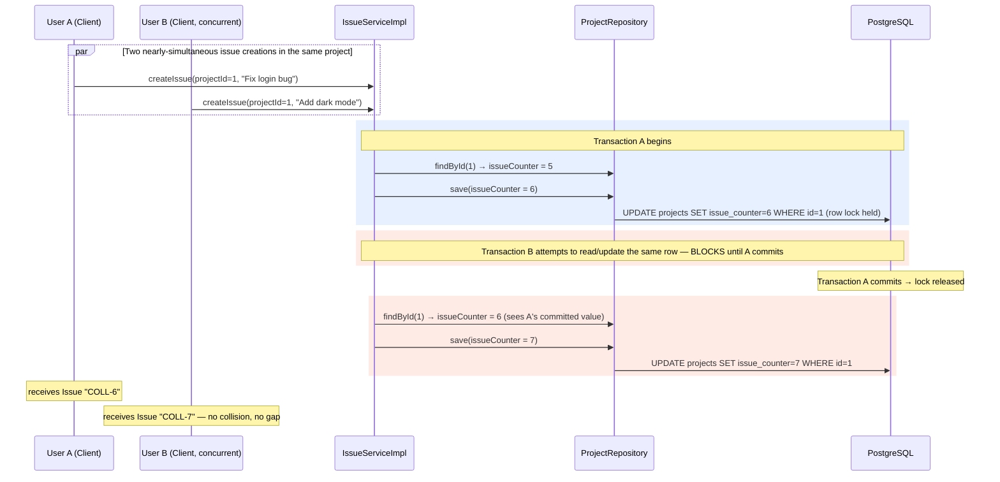

# 06 — Project Service (Jira-Style Projects & Issue-Key Generation)

> Prerequisite: `00-OVERVIEW-AND-ARCHITECTURE.md`, `03-WORKSPACE-SERVICE.md`. This module is the entry point into the "Jira half" of CollabHub — read this before `07-ISSUE-SERVICE.md` and `08-SPRINT-AND-BOARD-SERVICE.md`, since both depend on the `Project` entity and its `issueCounter` mechanism defined here.

---

## 1. Purpose & Responsibility

A `Project` lives inside a `Workspace` and is the container for `Issue`s and `Sprint`s — CollabHub's equivalent of a Jira "project" (e.g. `"COLL"` for the CollabHub project itself). This module owns:

- **Project CRUD.**
- **The project key** (`"COLL"`, `"BUG"`, etc.) — a short, unique, human-readable identifier used as the prefix for every issue's key (`COLL-1`, `COLL-2`, …).
- **The atomic issue-number counter** that guarantees no two issues in the same project ever get the same number.

## 2. Package Structure

```
project/
 ├── controller/ProjectController.java
 ├── dto/ CreateProjectDTO, UpdateProjectDTO, ProjectResponseDTO
 ├── entity/ Project.java
 ├── repository/ ProjectRepository.java
 └── service/ ProjectService.java / ProjectServiceImpl.java
```

---

## 3. The `Project` Entity

```java
@Entity
@Table(name = "projects", uniqueConstraints = {
        @UniqueConstraint(columnNames = {"workspace_id", "project_key"})
})
public class Project {
    @Id @GeneratedValue(strategy = GenerationType.IDENTITY)
    private Long id;

    private String name;

    @Column(name = "project_key", nullable = false)
    private String projectKey;              // e.g. "COLL" — uppercase, short

    private String description;

    @ManyToOne(fetch = FetchType.LAZY) @JoinColumn(name = "workspace_id", nullable = false)
    private Workspace workspace;

    @ManyToOne(fetch = FetchType.LAZY) @JoinColumn(name = "creator_id", nullable = false)
    private User creator;

    @ManyToOne(fetch = FetchType.LAZY) @JoinColumn(name = "lead_id")
    private User lead;                      // nullable — optional project lead

    @Builder.Default
    private Integer issueCounter = 0;       // the atomic issue-numbering source

    @CreationTimestamp private LocalDateTime createdAt;
    @UpdateTimestamp   private LocalDateTime updatedAt;
}
```

**`@UniqueConstraint(columnNames = {"workspace_id", "project_key"})`** — the project key is unique *per workspace*, not globally, just like workspace names are unique per owner (`03-WORKSPACE-SERVICE.md` §4). Two different workspaces can each have their own `"COLL"` project without conflict, because issue keys (`COLL-1`) are only ever meaningful *within* a workspace's context in this system.

**`issueCounter`** is the single most important field in this entity — it's explained in full in §5, because understanding it requires first understanding how `Issue` keys are generated.

**`lead` is nullable, `creator` is not.** Every project has a definite creator (whoever called the create endpoint), but assigning a "lead" (the person responsible for triaging/prioritizing the project's issues) is optional and can be set later or left unset.

---

## 4. `ProjectServiceImpl.createProject()`

```java
String projectKey = dto.getProjectKey().toUpperCase().trim();

if (projectRepository.findByWorkspaceIdAndProjectKey(workspace.getId(), projectKey).isPresent())
    throw new IllegalArgumentException("Project key already exists in this workspace");

Project project = Project.builder()
        .name(dto.getName()).projectKey(projectKey).description(dto.getDescription())
        .workspace(workspace).creator(creator).issueCounter(0)
        .build();
```

**`.toUpperCase().trim()` is a small but important normalization step** — it guarantees `"coll"`, `"Coll"`, and `"COLL "` (with trailing whitespace) all collapse to the exact same canonical key `"COLL"` before the uniqueness check and before persistence. Without this, you could accidentally end up with two "different" projects (`"COLL"` and `"coll"`) that are conceptually the same key but distinct database rows — confusing for users and for the uniqueness constraint, which is case-sensitive at the database level.

The explicit uniqueness check (`findByWorkspaceIdAndProjectKey`, throwing a friendly error) *before* attempting the insert follows the same pattern seen in `user`/`workspace` — fail with a clear, typed message rather than letting a raw database constraint violation bubble up as an opaque `500`.

---

## 5. The Issue-Key Generation Mechanism — `issueCounter`

This is the piece of the `project` module most worth understanding deeply, because it's the foundation that makes `07-ISSUE-SERVICE.md`'s key generation possible.

Every `Issue` needs a unique, human-friendly key like `COLL-1`, `COLL-2`, `COLL-3`, … — strictly incrementing, per project, with no gaps or collisions, even if two people create issues in the same project at the *exact* same moment. `IssueServiceImpl.createIssue()` does this:

```java
@Transactional
public IssueResponseDTO createIssue(CreateIssueDTO dto, String reporterEmail) {
    ...
    Project project = projectRepository.findById(dto.getProjectId())
            .orElseThrow(...);

    // Atomically increment and read the next number
    project.setIssueCounter(project.getIssueCounter() + 1);
    Project savedProject = projectRepository.save(project);

    String issueKey = savedProject.getProjectKey() + "-" + savedProject.getIssueCounter();

    Issue issue = Issue.builder().issueKey(issueKey) ... .build();
    ...
}
```

**Why store a running counter on `Project` instead of, say, `COUNT(*) FROM issues WHERE project_id = ?` or `MAX(issue_number)`?**

- **`COUNT(*)` is unsafe once deletions are possible.** If an issue is ever deleted, the count would decrease, and the *next* generated number could collide with an already-issued (but not yet deleted) key, or worse, reused a key that a user still has bookmarked/referenced elsewhere (in a message's `relatedIssueKey`, a comment, a browser tab). A dedicated, monotonically-increasing counter that is **never decremented**, even on issue deletion, guarantees keys are never reused.
- **A dedicated counter column is a simpler, single-row read+write** compared to scanning/aggregating the `issues` table on every single issue creation — cheaper as the number of issues in a project grows into the thousands.
- **Why `@Transactional` matters here specifically:** the whole sequence — read `issueCounter`, increment it, save it, then use the new value to build the issue's key, then save the issue itself — must be atomic. Picture two users creating an issue in the same project at nearly the same instant without a transaction and without appropriate locking: both could read `issueCounter = 5` before either writes back `6`, and both would compute the key `COLL-6`, producing a duplicate. Wrapping this in `@Transactional` (backed by the database's row-level locking on the `UPDATE` to the `projects` row) ensures the second concurrent transaction has to wait for the first to commit its increment before it can read the updated value — serializing the two `create` operations at exactly the point where a race could occur, without requiring any additional application-level locking code.

This is a textbook example of using **the database's own transaction isolation** to solve a concurrency problem that would otherwise require a separate distributed lock or a database sequence object — a lightweight, portable, no-extra-infrastructure solution appropriate for this scale.

---

## 6. Authorization: `isProjectAdmin()`

```java
private boolean isProjectAdmin(Project project, User user) {
    if (Role.ADMIN.equals(user.getRole())) return true;
    if (project.getCreator().getId().equals(user.getId())) return true;
    if (project.getLead() != null && project.getLead().getId().equals(user.getId())) return true;
    return project.getWorkspace().getOwner().getId().equals(user.getId());
}
```

Four independent paths grant project-management rights, in order of how the code checks them: **platform admin, project creator, project lead (if one is assigned), or the parent workspace's owner.** This is the same layered-authority pattern seen in `04-CHANNEL-SERVICE.md` §4 (creator OR workspace-owner OR admin), extended here with one extra tier specific to this domain — the optional "lead" role, which lets a project be delegated to someone other than its original creator without requiring a full workspace-ownership transfer.

`updateProject()` and `deleteProject()` both require `isProjectAdmin()`. Regular project *viewing* and issue creation only require workspace membership (checked the same way as in `channel`/`message`: `workspaceMemberRepository.findByWorkspaceIdAndUserIdAndRemovedAtIsNull(...)`).

---

## 7. `ProjectController` — Endpoint Reference

| Method | Path | Who Can Call | Purpose |
|---|---|---|---|
| `POST` | `/api/projects` | Any active workspace member | Create a project |
| `GET` | `/api/projects/{id}` | Any active workspace member | View project details |
| `GET` | `/api/projects/workspace/{workspaceId}` | Any active workspace member | List all projects in a workspace |
| `PUT` | `/api/projects/{id}` | Creator, lead, workspace owner, or admin | Update name/description/lead |
| `DELETE` | `/api/projects/{id}` | Creator, lead, workspace owner, or admin | Delete project (and, transitively, its issues/sprints) |

---

## 8. Create-Issue Key-Generation Workflow — Sequence Diagram

This diagram shows the exact concurrency-safety mechanism from §5 in action, since it's the project module's `issueCounter` that makes it work, even though the endpoint being called technically lives in the `issue` module.



---

## 9. FAQ / Things You Should Be Able to Answer

**Q: Why is `projectKey` uppercased and trimmed before saving?**
A: To normalize input so `"coll"` and `"COLL"` can't accidentally become two distinct project keys that are visually/conceptually identical — enforcing one canonical casing for a human-facing identifier that's meant to be short and memorable (like `JIRA`, `COLL`).

**Q: What guarantees two issues never get the same key, even under concurrent requests?**
A: The `Project.issueCounter` field, incremented and saved inside a `@Transactional` method. The database's row-level locking on the `UPDATE` to that counter row serializes concurrent creations, so each request reads a value only after the previous one has committed its increment.

**Q: If an issue is deleted, does its number get reused by the next issue created?**
A: No — the counter only ever increases, regardless of deletions. A gap (e.g. `COLL-5` missing because it was deleted) is preferable to a collision (two different issues both claiming `COLL-5`).

**Q: Who can change a project's lead?**
A: Anyone who passes `isProjectAdmin()` — the creator, the current lead, the workspace owner, or a platform admin — via `updateProject()`.

**Q: Is `projectKey` unique across the whole application, or just within a workspace?**
A: Just within a workspace (`@UniqueConstraint(columnNames = {"workspace_id", "project_key"})`). Two separate workspaces can each independently have a project keyed `"COLL"`.
