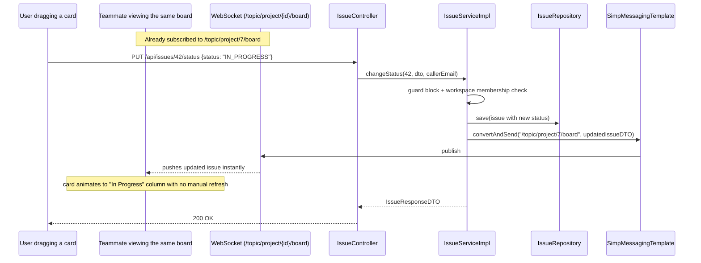

# 07 — Issue Service (Issue Tracking, Filtering, Real-Time Board Events)

> Prerequisite: `00-OVERVIEW-AND-ARCHITECTURE.md`, `06-PROJECT-SERVICE.md` (issue-key generation), `05-MESSAGE-AND-REALTIME-SERVICE.md` (the WebSocket broadcast mechanism, reused here). Related: `08-SPRINT-AND-BOARD-SERVICE.md` — issues and sprints are tightly coupled; this doc covers the `Issue` entity and its own CRUD, while the board-assembly logic lives in the sprint doc.

---

## 1. Purpose & Responsibility

An `Issue` is CollabHub's equivalent of a Jira ticket — a single unit of trackable work (a bug, a task, a story, an epic) that belongs to exactly one `Project`, optionally belongs to one `Sprint`, has a status, priority, type, a reporter, and an optional assignee. This module owns:

- **Issue CRUD** and **status transitions** (the mechanics of moving an issue through its lifecycle).
- **Filtering/search** across a project's issues (by status, assignee, priority, type, sprint).
- **Real-time board events** — broadcasting issue changes over WebSocket so a Kanban board UI updates live.

## 2. Package Structure

```
issue/
 ├── controller/IssueController.java
 ├── dto/ CreateIssueDTO, UpdateIssueDTO, IssueResponseDTO, IssueFilterDTO, ...
 ├── entity/ Issue.java, IssueStatus.java, IssuePriority.java, IssueType.java
 ├── repository/IssueRepository.java
 └── service/ IssueService.java / IssueServiceImpl.java
```

---

## 3. The `Issue` Entity

```java
@Entity
@Table(name = "issues")
public class Issue {
    @Id @GeneratedValue(strategy = GenerationType.IDENTITY)
    private Long id;

    @Column(nullable = false, unique = true)
    private String issueKey;                    // "COLL-1" — see 06-PROJECT-SERVICE.md §5

    @Column(nullable = false)
    private String title;
    @Column(length = 5000)
    private String description;

    @Enumerated(EnumType.STRING) @Builder.Default
    private IssueStatus status = IssueStatus.TODO;
    @Enumerated(EnumType.STRING) @Builder.Default
    private IssuePriority priority = IssuePriority.MEDIUM;
    @Enumerated(EnumType.STRING) @Builder.Default
    private IssueType type = IssueType.TASK;

    @ManyToOne(fetch = FetchType.LAZY) @JoinColumn(name = "project_id", nullable = false)
    private Project project;

    @ManyToOne(fetch = FetchType.LAZY) @JoinColumn(name = "reporter_id", nullable = false)
    private User reporter;

    @ManyToOne(fetch = FetchType.LAZY) @JoinColumn(name = "assignee_id")
    private User assignee;                       // nullable — unassigned issues are valid

    @ManyToOne(fetch = FetchType.LAZY) @JoinColumn(name = "sprint_id")
    private Sprint sprint;                        // nullable — null means "in the backlog"

    private Integer storyPoints;                  // nullable — estimation
    private LocalDateTime dueDate;

    @CreationTimestamp private LocalDateTime createdAt;
    @UpdateTimestamp   private LocalDateTime updatedAt;
}
```

### Enums

```java
public enum IssueStatus  { TODO, IN_PROGRESS, IN_REVIEW, DONE }
public enum IssuePriority{ LOW, MEDIUM, HIGH, CRITICAL }
public enum IssueType    { BUG, TASK, STORY, EPIC }
```

Three independent, orthogonal classification axes — an issue's *status* (where it is in the workflow), *priority* (how urgent), and *type* (what kind of work it represents) are tracked separately rather than folded into one combined field, which is exactly how Jira and similar tools model this, and it's what makes multi-axis filtering (§5) possible.

**Two nullable relationships carry real domain meaning, not just "data not entered yet":**

- **`assignee = null` means "unassigned"** — a completely valid, common state (an issue can sit in the backlog with a reporter but no owner yet).
- **`sprint = null` means "in the backlog"** — this is the mechanism the board (see `08-SPRINT-AND-BOARD-SERVICE.md`) uses to distinguish backlog issues from sprint-assigned issues. There's no separate `"BACKLOG"` boolean flag; the absence of a sprint association *is* the backlog state. This is a clean, storage-efficient way to model "belongs to nothing yet" without an extra column, though it does mean any query for "backlog issues" needs `WHERE sprint_id IS NULL`, which `IssueRepository` provides as a dedicated method (`findByProjectIdAndSprintIsNull`).

---

## 4. `IssueServiceImpl.createIssue()` — Recap + What's New Here

The concurrency-safe key-generation logic (`project.issueCounter`) was covered in full in `06-PROJECT-SERVICE.md` §5 — refer there for the deep explanation of *why* it's `@Transactional` and how it avoids duplicate keys under concurrent creation. What's specific to this module:

```java
User reporter = findActiveUser(reporterEmail);   // the standard guard block, extracted as a helper here
Project project = projectRepository.findById(dto.getProjectId()).orElseThrow(...);
Workspace workspace = project.getWorkspace();
if (workspace.getSuspended()) throw new WorkspaceSuspendedException(...);
requireWorkspaceMember(workspace.getId(), reporter.getId());

User assignee = null;
if (dto.getAssigneeId() != null) {
    assignee = findActiveUser(...); // by ID this time
    requireWorkspaceMember(workspace.getId(), assignee.getId());  // assignee must ALSO be a workspace member
}
```

Notice the assignee, if provided, must independently pass the **same** workspace-membership check as the reporter — you cannot assign an issue to someone outside the workspace, even if you (the reporter) are creating the issue and have full rights to do so. This prevents accidentally (or maliciously) assigning work to, and thereby exposing project details to, a user who has no legitimate access to the project's workspace.

`findActiveUser(email)` and `requireWorkspaceMember(workspaceId, userId)` are private helper methods in `IssueServiceImpl` — a direct, concrete example of the DRY refactor mentioned in the overview §4: the "does this user exist / is it deleted / is it banned" guard block, and the "is this user an active workspace member" check, both got extracted into small reusable private methods once they started repeating across `createIssue`, `updateIssue`, `assignIssue`, `changeStatus`, etc.

---

## 5. Filtering — `IssueFilterDTO` and Dynamic Query Building

```java
public List<IssueResponseDTO> filterIssues(Long projectId, IssueFilterDTO filter, String userEmail) {
    ...
    List<Issue> issues = issueRepository.findByProjectId(projectId);

    return issues.stream()
            .filter(issue -> filter.getStatus() == null || issue.getStatus() == filter.getStatus())
            .filter(issue -> filter.getPriority() == null || issue.getPriority() == filter.getPriority())
            .filter(issue -> filter.getType() == null || issue.getType() == filter.getType())
            .filter(issue -> filter.getAssigneeId() == null || (issue.getAssignee() != null && issue.getAssignee().getId().equals(filter.getAssigneeId())))
            .filter(issue -> filter.getSprintId() == null || (issue.getSprint() != null && issue.getSprint().getId().equals(filter.getSprintId())))
            .map(this::convertToDTO)
            .collect(Collectors.toList());
}
```

This uses **in-memory Java Stream filtering** (fetch all of a project's issues, then filter with chained lambda predicates) rather than building a dynamic SQL/JPQL query with a Spring Data `Specification` or a hand-rolled conditional `@Query`. Each `.filter(...)` clause follows the same pattern: *if the filter criterion wasn't provided (`null`), pass every issue through unchanged; otherwise, keep only issues matching it.* This composes multiple optional filters cleanly with plain, readable Java — no dynamic string-building or JPA Criteria API boilerplate.

**Trade-off worth understanding:** this approach is simple and very readable, but it pulls *every* issue in the project into application memory before filtering, which doesn't scale as well as a database-level `WHERE` clause once a project has thousands of issues (the database would do the filtering far more efficiently, and only transfer matching rows). For a project management tool at moderate scale this is a perfectly reasonable, pragmatic choice; it's the kind of thing worth revisiting with a proper `Specification`-based dynamic query if performance profiling ever showed this filtering step as a bottleneck.

---

## 6. Status Transitions & Real-Time Board Broadcasting

```java
@Transactional
public IssueResponseDTO changeStatus(Long issueId, ChangeStatusDTO dto, String userEmail) {
    ...
    issue.setStatus(dto.getStatus());
    Issue saved = issueRepository.save(issue);
    IssueResponseDTO responseDTO = convertToDTO(saved);

    messagingTemplate.convertAndSend(
            "/topic/project/" + issue.getProject().getId() + "/board",
            responseDTO
    );

    return responseDTO;
}
```

This is the same `SimpMessagingTemplate.convertAndSend(...)` mechanism documented in full in `05-MESSAGE-AND-REALTIME-SERVICE.md` §5 — reused here for a completely different domain event. The topic namespace, `/topic/project/{projectId}/board`, is deliberately distinct from the chat topic (`/topic/channel/{channelId}`), keeping the two real-time feature areas cleanly separated even though they share the exact same underlying broker infrastructure (`config/StompWebSocketConfig.java`, described once, reused everywhere).

**Why this matters for the UX it enables:** a Kanban board (see `08-SPRINT-AND-BOARD-SERVICE.md`) is a highly collaborative, "everyone's looking at the same board" UI. Without real-time push, every teammate would need to manually refresh to see a card someone else just dragged to "Done". With this broadcast in place, dragging a card on one person's screen instantly animates the same move on every other open board for that project.

The same broadcast call appears after `assignIssue()`, `updateIssue()`, and `deleteIssue()` too — any change that would visually affect the board triggers a push, following the identical "same DTO used for both the HTTP response and the broadcast payload" pattern from the message module.

---

## 7. `IssueController` — Endpoint Reference

| Method | Path | Purpose |
|---|---|---|
| `POST` | `/api/issues` | Create an issue (auto-generates `issueKey`) |
| `GET` | `/api/issues/{id}` | Get one issue |
| `GET` | `/api/issues/project/{projectId}` | All issues in a project |
| `GET` | `/api/issues/project/{projectId}/filter` | Filtered issue search (query params map to `IssueFilterDTO`) |
| `PUT` | `/api/issues/{id}` | Update title/description/priority/type/etc. |
| `PUT` | `/api/issues/{id}/status` | Change status — triggers board broadcast |
| `PUT` | `/api/issues/{id}/assign` | Change/clear assignee — triggers board broadcast |
| `DELETE` | `/api/issues/{id}` | Delete an issue |

All endpoints require the caller to be an active workspace member of the project's parent workspace (the standard `requireWorkspaceMember` helper). There's no separate "issue owner" concept distinct from the reporter/assignee here — any workspace member can edit any issue, which reflects how most collaborative issue trackers work (unlike, say, a message, which is strictly editable only by its sender).

---

## 8. Status Change → Live Board Update — Sequence Diagram



---

## 9. FAQ / Things You Should Be Able to Answer

**Q: How does the system know an issue is "in the backlog" versus "in a sprint"?**
A: There's no separate boolean flag — an issue is in the backlog precisely when `sprint` is `null`. Assigning it to a sprint (see `08-SPRINT-AND-BOARD-SERVICE.md`) simply sets that foreign key.

**Q: Can I assign an issue to someone who isn't part of the project's workspace?**
A: No — `createIssue`/`assignIssue` explicitly re-run the workspace-membership check against the proposed assignee, independent of the check already performed for the caller/reporter.

**Q: Why does filtering pull all of a project's issues into memory instead of using a `WHERE` clause with all the filter conditions?**
A: A deliberate simplicity trade-off — Java Stream filtering with optional predicates is easy to read and maintain for a moderate number of issues per project, at the cost of scaling less gracefully than a database-level dynamic query for very large projects.

**Q: What real-time channel do board changes use, and is it the same one chat messages use?**
A: Same underlying WebSocket/STOMP infrastructure (`config/StompWebSocketConfig.java`), but a different topic namespace — `/topic/project/{id}/board` for issues versus `/topic/channel/{id}` for chat — so the two feature areas' live updates never cross-contaminate on the frontend.

**Q: Who is allowed to edit an issue someone else reported?**
A: Any active member of the project's workspace — issue editing isn't restricted to the reporter or assignee the way message editing is restricted to the sender.
