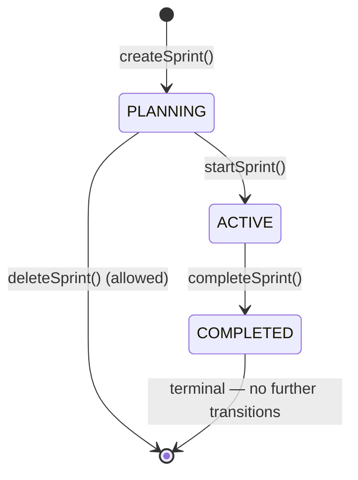
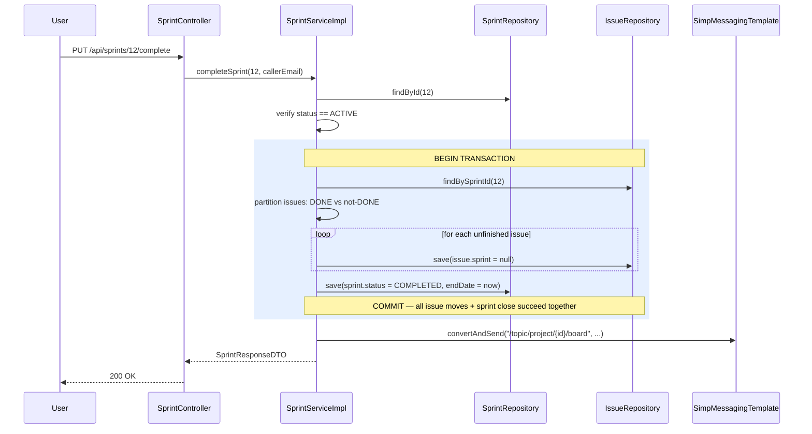
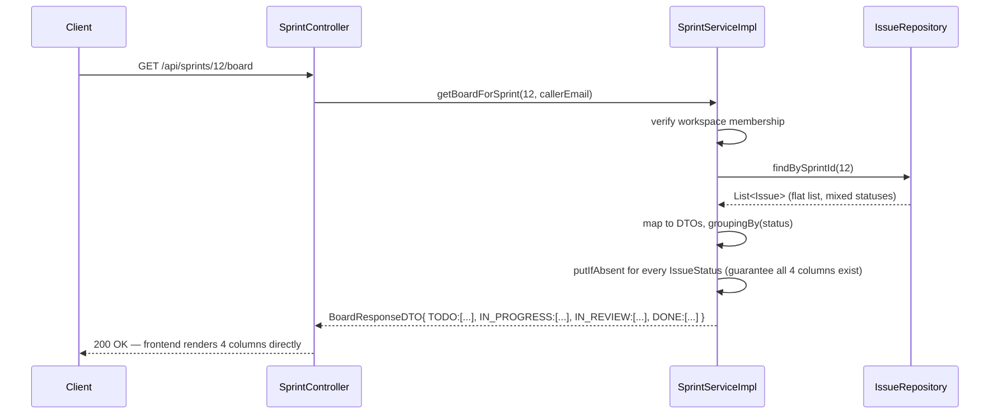

# 08 — Sprint & Board Service (Sprint Lifecycle State Machine, Kanban Board Assembly)

> Prerequisite: `00-OVERVIEW-AND-ARCHITECTURE.md`, `06-PROJECT-SERVICE.md`, `07-ISSUE-SERVICE.md` (sprints are containers *for* issues — you need to understand `Issue.sprint` and `Issue.status` before this doc makes full sense).

---

## 1. Purpose & Responsibility

A `Sprint` is a time-boxed iteration of work inside a `Project` — CollabHub's equivalent of a Jira/Scrum sprint. This module owns:

- **Sprint CRUD** and its **lifecycle state machine** (`PLANNING → ACTIVE → COMPLETED`).
- **Adding/removing issues** to/from a sprint (moving them out of the backlog).
- **Completing a sprint** — the "what happens to unfinished work" logic.
- **Assembling the Kanban board view** — grouping a sprint's (or the backlog's) issues by status into board columns, ready for a frontend to render directly.

## 2. Package Structure

```
sprint/
 ├── controller/SprintController.java
 ├── dto/ CreateSprintDTO, UpdateSprintDTO, SprintResponseDTO, BoardResponseDTO, ...
 ├── entity/ Sprint.java, SprintStatus.java
 ├── repository/SprintRepository.java
 └── service/ SprintService.java / SprintServiceImpl.java
```

---

## 3. The `Sprint` Entity & State Machine

```java
@Entity
@Table(name = "sprints")
public class Sprint {
    @Id @GeneratedValue(strategy = GenerationType.IDENTITY)
    private Long id;

    private String name;
    private String goal;

    @Enumerated(EnumType.STRING) @Builder.Default
    private SprintStatus status = SprintStatus.PLANNING;

    private LocalDateTime startDate;
    private LocalDateTime endDate;

    @ManyToOne(fetch = FetchType.LAZY) @JoinColumn(name = "project_id", nullable = false)
    private Project project;

    @CreationTimestamp private LocalDateTime createdAt;
    @UpdateTimestamp   private LocalDateTime updatedAt;
}

public enum SprintStatus { PLANNING, ACTIVE, COMPLETED }
```

### The state machine, drawn out



This is a strict, one-directional state machine — a sprint can never go backwards (`ACTIVE` can't return to `PLANNING`, `COMPLETED` can't reopen to `ACTIVE`). This mirrors real Scrum practice: once a sprint is closed, it's closed; if more work is needed, you start a *new* sprint rather than reopening an old one, preserving an honest historical record of what actually happened in each sprint.

### `startSprint()` — enforcing "only one active sprint per project"

```java
@Transactional
public SprintResponseDTO startSprint(Long sprintId, String userEmail) {
    Sprint sprint = sprintRepository.findById(sprintId).orElseThrow(...);
    ...
    if (sprint.getStatus() != SprintStatus.PLANNING)
        throw new IllegalStateException("Only sprints in PLANNING status can be started");

    boolean hasActiveSprint = sprintRepository
            .findByProjectIdAndStatus(sprint.getProject().getId(), SprintStatus.ACTIVE)
            .isPresent();
    if (hasActiveSprint)
        throw new IllegalStateException("This project already has an active sprint. Complete it first.");

    sprint.setStatus(SprintStatus.ACTIVE);
    sprint.setStartDate(LocalDateTime.now());
    sprintRepository.save(sprint);
    ...
}
```

Two guard checks, both essential to correct Scrum semantics:

1. **You can only start a sprint that's still in `PLANNING`** — you can't "start" an already-active or already-completed sprint. This also implicitly prevents double-starting.
2. **A project may have at most one `ACTIVE` sprint at a time.** This reflects standard Scrum practice — a team focuses on one sprint's worth of work at a time. Attempting to start a second sprint while one is already running is explicitly rejected with a clear, actionable error message ("Complete it first"), rather than silently allowing two concurrent active sprints, which would make the board (§5) ambiguous about which sprint's issues to show.

`startDate` is stamped with the *actual* start moment (`LocalDateTime.now()`), not necessarily whatever date was originally planned at creation time — a deliberate choice to record real history over intended history.

### `completeSprint()` — the "what happens to unfinished work" decision

```java
@Transactional
public SprintResponseDTO completeSprint(Long sprintId, String userEmail) {
    Sprint sprint = sprintRepository.findById(sprintId).orElseThrow(...);
    if (sprint.getStatus() != SprintStatus.ACTIVE)
        throw new IllegalStateException("Only ACTIVE sprints can be completed");

    List<Issue> sprintIssues = issueRepository.findBySprintId(sprintId);
    List<Issue> unfinishedIssues = sprintIssues.stream()
            .filter(issue -> issue.getStatus() != IssueStatus.DONE)
            .collect(Collectors.toList());

    unfinishedIssues.forEach(issue -> {
        issue.setSprint(null);       // moves it back to the backlog
        issueRepository.save(issue);
    });

    sprint.setStatus(SprintStatus.COMPLETED);
    sprint.setEndDate(LocalDateTime.now());
    sprintRepository.save(sprint);

    // real-time board broadcast (see §6)
    ...
}
```

This is the module's **other** `@Transactional` write requiring multi-entity atomicity (alongside `WorkspaceMemberServiceImpl.transferOwnership()` in the overview §5.6): completing a sprint means potentially updating *N* issue rows (unassigning each unfinished one from the sprint) **plus** the sprint row itself, and all of it needs to succeed or fail together — you'd never want a scenario where the sprint is marked `COMPLETED` but some unfinished issues are left dangling, still pointing at a now-closed sprint.

**The business rule, stated plainly: any issue not in `DONE` status when a sprint completes is automatically returned to the backlog** (`issue.setSprint(null)`) rather than being deleted, hidden, or force-marked as done. This matches real Scrum practice — incomplete work doesn't vanish at the end of a sprint; it goes back into the pool to be picked up (usually re-prioritized) in a future sprint. The issue keeps its full history (comments, status, assignee) — only its `sprint` association is cleared.

---

## 4. Adding/Removing Issues — Moving Between Backlog and Sprint

```java
public IssueResponseDTO addIssueToSprint(Long sprintId, Long issueId, String userEmail) {
    Sprint sprint = sprintRepository.findById(sprintId).orElseThrow(...);
    Issue issue = issueRepository.findById(issueId).orElseThrow(...);

    if (!issue.getProject().getId().equals(sprint.getProject().getId()))
        throw new IllegalArgumentException("Issue does not belong to the same project as the sprint");

    issue.setSprint(sprint);
    return convertToDTO(issueRepository.save(issue));
}

public IssueResponseDTO removeIssueFromSprint(Long issueId, String userEmail) {
    Issue issue = issueRepository.findById(issueId).orElseThrow(...);
    issue.setSprint(null);   // back to backlog
    return convertToDTO(issueRepository.save(issue));
}
```

The cross-project guard (`issue.getProject().getId().equals(sprint.getProject().getId())`) is a data-integrity safeguard specific to this operation: an issue from Project A should never end up inside a sprint belonging to Project B, since sprints and their boards are fundamentally scoped to a single project. Without this check, a caller with access to two different projects' IDs could otherwise mix them up by mistake (or on purpose) and corrupt the board's grouping logic.

---

## 5. Board Assembly — `getBoardForSprint()` / `getBacklogBoard()`

The Kanban board is not stored anywhere — it's **computed on read**, by grouping a set of issues (either a sprint's issues, or the project's backlog) by their `status`:

```java
public BoardResponseDTO getBoardForSprint(Long sprintId, String userEmail) {
    Sprint sprint = sprintRepository.findById(sprintId).orElseThrow(...);
    List<Issue> issues = issueRepository.findBySprintId(sprintId);

    Map<IssueStatus, List<IssueResponseDTO>> columns = issues.stream()
            .map(this::convertIssueToDTO)
            .collect(Collectors.groupingBy(IssueResponseDTO::getStatus));

    // ensure every status column exists in the response, even if empty
    for (IssueStatus status : IssueStatus.values()) {
        columns.putIfAbsent(status, new ArrayList<>());
    }

    return BoardResponseDTO.builder()
            .sprintId(sprintId).sprintName(sprint.getName())
            .columns(columns)
            .build();
}
```

**Why compute this on every read rather than storing a "board" record?** A Kanban board has no independent existence or identity beyond "the current arrangement of a set of issues by status" — it's a *view*, not a distinct piece of state. Persisting it separately would mean keeping it perpetually in sync with the underlying `Issue.status` field (a classic denormalization/consistency headache — every status change would need to update two places). Instead, `Issue.status` is the single source of truth, and the board is simply a `groupingBy` transformation applied fresh on every request. This guarantees the board can never drift out of sync with reality, at a small, entirely acceptable CPU cost.

**The `putIfAbsent` loop over every `IssueStatus` value is a small but important UX detail:** without it, a brand-new sprint with zero issues in, say, `IN_REVIEW` would simply have no `IN_REVIEW` key in the returned map at all — the frontend would need extra defensive logic to render an empty column. By guaranteeing every status always has an entry (even if it's an empty list), the frontend can render a fixed, predictable set of columns (`To Do | In Progress | In Review | Done`) every single time, with no special-casing.

`getBacklogBoard(projectId)` is the same grouping logic applied to `issueRepository.findByProjectIdAndSprintIsNull(projectId)` instead — the "board" abstraction is reused for viewing unassigned work too, just scoped by project instead of by sprint.

---

## 6. Real-Time Broadcasting from the Sprint Module

Following the exact pattern established in `05-MESSAGE-AND-REALTIME-SERVICE.md` §5 and reused in `07-ISSUE-SERVICE.md` §6, sprint-level state changes also broadcast to the board topic:

```java
messagingTemplate.convertAndSend(
        "/topic/project/" + sprint.getProject().getId() + "/board",
        boardResponseDTO   // or a lightweight event payload
);
```

This fires after `startSprint()`, `completeSprint()`, `addIssueToSprint()`, and `removeIssueFromSprint()` — any operation that changes *which issues appear on which board* pushes a fresh view so every connected client's board re-renders immediately, without a manual refresh. This is the same `/topic/project/{projectId}/board` destination the `issue` module's `changeStatus()` broadcasts to — **the frontend subscribes to one topic per project board and receives live updates regardless of whether the underlying change originated from a status drag, a sprint start, or a sprint completion.**

---

## 7. `SprintController` — Endpoint Reference

| Method | Path | Purpose |
|---|---|---|
| `POST` | `/api/sprints` | Create a sprint (starts in `PLANNING`) |
| `GET` | `/api/sprints/{id}` | Get sprint details |
| `GET` | `/api/sprints/project/{projectId}` | List all sprints in a project |
| `PUT` | `/api/sprints/{id}` | Update name/goal/dates (only while `PLANNING`, typically) |
| `PUT` | `/api/sprints/{id}/start` | `PLANNING → ACTIVE` |
| `PUT` | `/api/sprints/{id}/complete` | `ACTIVE → COMPLETED`, unfinished issues → backlog |
| `DELETE` | `/api/sprints/{id}` | Delete a sprint (typically only while `PLANNING`) |
| `POST` | `/api/sprints/{sprintId}/issues/{issueId}` | Add an issue to the sprint |
| `DELETE` | `/api/sprints/{sprintId}/issues/{issueId}` | Remove an issue from the sprint (→ backlog) |
| `GET` | `/api/sprints/{sprintId}/board` | Assembled Kanban board for this sprint |
| `GET` | `/api/sprints/project/{projectId}/backlog` | Assembled board of unassigned (backlog) issues |

---

## 8. Sprint Completion Workflow — Sequence Diagram



## 9. Board Assembly — Sequence Diagram



---

## 10. FAQ / Things You Should Be Able to Answer

**Q: Can a project have two active sprints at once?**
A: No — `startSprint()` explicitly checks for an existing `ACTIVE` sprint in the same project and rejects the request if one exists.

**Q: What happens to an issue that's still `IN_PROGRESS` when its sprint is completed?**
A: It's automatically unassigned from the sprint (`sprint = null`) and returns to the project's backlog. Its status and all other data are untouched — only the sprint association is cleared.

**Q: Is the Kanban board a table in the database?**
A: No — it's computed on every request by grouping the relevant issues (by sprint, or by "no sprint" for the backlog) using their live `status` field. There's no separate "board" storage to keep in sync.

**Q: Why does the board response always include all four status columns, even empty ones?**
A: So the frontend can render a fixed, predictable board layout without needing conditional logic for "what if this column has no cards yet" — `putIfAbsent` guarantees every `IssueStatus` key is present in the response map.

**Q: Can a sprint go from `COMPLETED` back to `ACTIVE` if it turns out there's more work to do?**
A: No — the state machine is one-directional and `COMPLETED` is terminal. The correct workflow is to start a new sprint for the remaining/backlog work.

**Q: Can I add an issue from Project A into a sprint that belongs to Project B?**
A: No — `addIssueToSprint()` explicitly checks the issue's project matches the sprint's project and throws `IllegalArgumentException` otherwise.

**Q: How does a frontend know to refresh the board when a teammate drags a card?**
A: It subscribes once to `/topic/project/{projectId}/board`; every status change (from `IssueService`), sprint start, sprint completion, and issue-to-sprint move (from `SprintService`) broadcasts a fresh update to that same topic.
