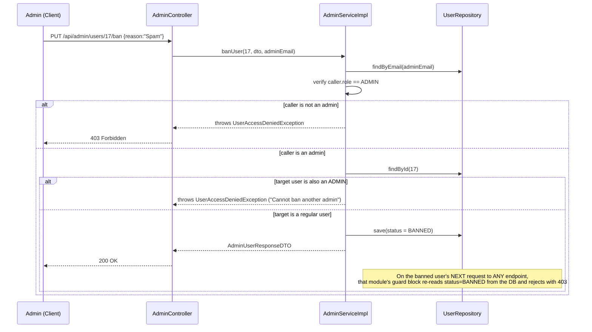

# 09 — Admin Service (Platform Administration: Bans, Suspensions, Statistics)

> Prerequisite: `00-OVERVIEW-AND-ARCHITECTURE.md` (§5.3 — the two independent role systems; this module is entirely about the *global* `Role.ADMIN`, not any workspace-level role), `02-USER-SERVICE.md`, `03-WORKSPACE-SERVICE.md`.

---

## 1. Purpose & Responsibility

The `admin` module is the platform-operator's toolkit — functionality available only to users with the global `Role.ADMIN`, operating *across* workspace boundaries (unlike every other module, which is scoped to "your" workspaces/channels/projects). It owns:

- **Banning/unbanning users** — a platform-wide account freeze.
- **Suspending/lifting suspension on workspaces** — a tenant-wide freeze.
- **Platform statistics** — aggregate counts across all users/workspaces/channels/messages/projects/issues, for an admin dashboard.
- **Unrestricted visibility** — listing all users, all workspaces, regardless of the caller's own membership.

## 2. Package Structure

```
admin/
 ├── controller/AdminController.java
 ├── dto/  AdminUserResponseDTO, AdminWorkspaceResponseDTO, PlatformStatsDTO, BanUserDTO, SuspendWorkspaceDTO, ...
 └── service/ AdminService.java / AdminServiceImpl.java
```

Notice: **no `entity/` or `repository/` package.** This module deliberately owns no entities of its own — it operates entirely on entities defined in *other* modules (`User` from `user`, `Workspace` from `workspace`, plus read-only counts from `channel`, `message`, `project`, `issue` repositories). This is a clean illustration of the "package by feature" philosophy (overview §3) still allowing a feature to be primarily about *orchestrating across* other features rather than owning new data of its own.

---

## 3. The Single Gate: `verifyAdminRole()`

```java
private User verifyAdminRole(String email) {
    User user = userRepository.findByEmail(email)
            .orElseThrow(() -> new UserNotFoundException("User not found"));

    if (user.getDeletedAt() != null)
        throw new UserNotFoundException("User account is deleted");

    if (!Role.ADMIN.equals(user.getRole()))
        throw new UserAccessDeniedException("Access denied. Admin privileges required.");

    return user;
}
```

**Every single method in `AdminServiceImpl` calls this first, with zero exceptions.** This is the strictest, simplest authorization check anywhere in the codebase — no "or workspace owner", no "or resource creator" escalation paths like the layered `||` checks seen in `channel`/`project`/`sprint`. You are either a platform `ADMIN`, or you get a `403 UserAccessDeniedException` immediately. This reflects the nature of the module: these are platform-operator actions (banning a user, freezing an entire tenant) that should never be delegable to a mere workspace owner, no matter how much authority they hold *within* their own workspace.

Note this helper intentionally does **not** check `UserStatus.BANNED` on the admin themselves — a subtle but sensible omission: if it did, and an admin somehow got banned (e.g. by another admin, or by mistake), they'd be permanently locked out of the one part of the system that could reverse a ban, with no path back in except direct database intervention. As written, a banned admin can still exercise admin powers, including presumably un-banning themselves. This is worth flagging as a deliberate-or-accidental design decision depending on how you read it — either a sensible safety valve, or a gap depending on the intended operational model.

---

## 4. Banning & Unbanning Users

```java
public AdminUserResponseDTO banUser(Long userId, BanUserDTO dto, String adminEmail) {
    verifyAdminRole(adminEmail);

    User user = userRepository.findById(userId).orElseThrow(...);

    if (Role.ADMIN.equals(user.getRole()))
        throw new UserAccessDeniedException("Cannot ban another admin");

    user.setStatus(UserStatus.BANNED);
    userRepository.save(user);
    return convertToAdminDTO(user);
}
```

**"Cannot ban another admin" is an important safety rule.** Without it, one rogue or compromised admin account could ban every other admin, effectively locking the entire platform-operator team out of their own system with no recovery path short of direct database access. This check enforces a simple invariant: admin-vs-admin conflicts must be resolved outside the API (e.g. by whoever controls the database or a super-admin process), not through the ban feature itself.

Notice banning **does not check anything about the target's current sessions or JWTs** — a banned user's existing, still-unexpired JWT remains cryptographically valid (see `01-AUTH-SERVICE.md` §6, "no explicit ban check inside `login()`"). What actually stops them is that *every other module's guard block* (overview §4) re-checks `UserStatus` against the database on every request, so the ban takes effect on their very next action, even without invalidating any already-issued token.

`unbanUser()` is the mirror operation — sets `status` back to `ACTIVE`, with the same admin-role gate, and no special restriction (an admin can unban anyone, including someone another admin banned).

---

## 5. Suspending & Lifting Suspension on Workspaces

```java
public AdminWorkspaceResponseDTO suspendWorkspace(Long workspaceId, SuspendWorkspaceDTO dto, String adminEmail) {
    verifyAdminRole(adminEmail);
    Workspace workspace = workspaceRepository.findById(workspaceId).orElseThrow(...);

    workspace.setSuspended(true);
    workspace.setSuspendedAt(LocalDateTime.now());
    workspace.setSuspensionReason(dto.getReason());
    workspaceRepository.save(workspace);
    return convertToAdminDTO(workspace);
}
```

Suspension is the **tenant-wide equivalent** of banning a user — instead of freezing one account, it freezes an entire workspace and everything inside it. As traced through every other module's documentation in this set, `workspace.getSuspended()` is checked before nearly every write operation in `channel`, `message` (indirectly, via channel), `project`, `issue`, and `sprint` — a suspended workspace becomes fully **read-only** for all of its members, including its own owner, who cannot lift the suspension themselves (only an admin can, via `liftSuspension()`).

`dto.getReason()` is stored (`suspensionReason`) so the frontend can surface *why* a workspace was frozen to its confused members (e.g. "Suspended for Terms of Service violation") rather than leaving them staring at an opaque permission error.

`liftSuspension()` clears all three fields (`suspended = false`, `suspendedAt = null`, `suspensionReason = null`), fully restoring normal operation.

---

## 6. Platform Statistics — `getPlatformStats()`

```java
public PlatformStatsDTO getPlatformStats(String adminEmail) {
    verifyAdminRole(adminEmail);

    long totalUsers = userRepository.count();
    long activeUsers = userRepository.countByStatusAndDeletedAtIsNull(UserStatus.ACTIVE);
    long bannedUsers = userRepository.countByStatus(UserStatus.BANNED);
    long totalWorkspaces = workspaceRepository.count();
    long suspendedWorkspaces = workspaceRepository.countBySuspended(true);
    long totalChannels = channelRepository.count();
    long totalMessages = messageRepository.count();
    long totalProjects = projectRepository.count();
    long totalIssues = issueRepository.count();

    long newUsersThisWeek = userRepository.countByCreatedAtAfter(LocalDateTime.now().minusDays(7));
    long newUsersThisMonth = userRepository.countByCreatedAtAfter(LocalDateTime.now().minusDays(30));

    return PlatformStatsDTO.builder()
            .totalUsers(totalUsers).activeUsers(activeUsers).bannedUsers(bannedUsers)
            .totalWorkspaces(totalWorkspaces).suspendedWorkspaces(suspendedWorkspaces)
            .totalChannels(totalChannels).totalMessages(totalMessages)
            .totalProjects(totalProjects).totalIssues(totalIssues)
            .newUsersThisWeek(newUsersThisWeek).newUsersThisMonth(newUsersThisMonth)
            .build();
}
```

This is a good, concrete illustration of **cross-module composition without cross-module coupling of business logic**: `AdminServiceImpl` directly injects and calls `count()`/`countBy...()` methods on repositories owned by five *other* modules (`user`, `workspace`, `channel`, `message`, `project`, `issue`), but it never calls into their *service* classes. It only reads simple aggregate counts — it never invokes any business rule, guard check, or side-effect belonging to those other modules. This keeps the dependency shape shallow and one-directional: `admin` depends on other modules' repositories (fine — repositories are pure data access with no embedded business rules to accidentally duplicate or bypass), but no other module ever depends on `admin`.

**`countByCreatedAtAfter(...)` powers simple growth metrics** ("how many new users this week/month") — this is exactly the kind of lightweight, derived reporting query that's appropriate to compute on-demand for an admin dashboard, rather than something that needs its own dedicated analytics pipeline at CollabHub's scale.

Recall from `01-AUTH-SERVICE.md` §6 that `login()` updates `lastLoginAt` on every successful login — while `getPlatformStats()` as currently implemented doesn't surface a "recently active users" metric using that field, the data is there and ready for such a metric to be added without any schema change.

---

## 7. `AdminController` — Endpoint Reference

| Method | Path | Purpose |
|---|---|---|
| `GET` | `/api/admin/users` | List every user on the platform |
| `PUT` | `/api/admin/users/{id}/ban` | Ban a user (cannot target another admin) |
| `PUT` | `/api/admin/users/{id}/unban` | Restore a banned user to `ACTIVE` |
| `GET` | `/api/admin/workspaces` | List every workspace on the platform |
| `PUT` | `/api/admin/workspaces/{id}/suspend` | Freeze a workspace platform-wide |
| `PUT` | `/api/admin/workspaces/{id}/lift-suspension` | Restore a suspended workspace |
| `GET` | `/api/admin/stats` | Aggregate platform statistics |

Every one of these is protected identically: the controller extracts the caller's email via `SecurityUtil.getCurrentUserEmail()` exactly like every other controller in the app, and delegates to a service method that immediately calls `verifyAdminRole()` before doing anything else. There is no separate Spring Security URL-pattern rule (e.g. `.requestMatchers("/api/admin/**").hasRole("ADMIN")`) in `SecurityConfig` gating these paths — the enforcement is entirely inside the service layer, consistent with the codebase-wide philosophy (overview §5.4) of doing authorization in code rather than through Spring Security's declarative mechanisms. Anyone with a valid JWT can reach the controller method and the service method will begin executing, but `verifyAdminRole()` guarantees non-admins are rejected before any actual admin action takes effect.

---

## 8. Ban Workflow — Sequence Diagram



---

## 9. FAQ / Things You Should Be Able to Answer

**Q: Can an admin ban another admin?**
A: No — `banUser()` explicitly checks the target's role and rejects the operation with `UserAccessDeniedException` if the target is also an `ADMIN`. This prevents a compromised or rogue admin account from locking out the rest of the operator team.

**Q: If I ban a user who's currently logged in with a valid, unexpired JWT, are they immediately locked out?**
A: Their token remains cryptographically valid until it naturally expires, but every business action they attempt re-checks `UserStatus` against the database (the guard block, overview §4) — so their very next request to any protected write endpoint will fail with `403`, even though their token itself wasn't revoked.

**Q: Who can lift a workspace suspension — the workspace owner, or only an admin?**
A: Only an admin. A suspended workspace is deliberately read-only even to its own owner; owners have no path to self-unsuspend.

**Q: Does the `admin` module have its own database table?**
A: No — it has no `@Entity` classes of its own. It's purely an orchestration layer over the `User` and `Workspace` entities (and read-only aggregate counts from several other modules' repositories) owned by other modules.

**Q: Is admin access enforced by a URL pattern in `SecurityConfig`, like `hasRole("ADMIN")`?**
A: No — like the rest of the codebase, admin authorization is a manual code-level check (`verifyAdminRole()`), called at the top of every single `AdminServiceImpl` method, not a Spring Security declarative rule.

**Q: What happens to a workspace's channels/projects/messages while it's suspended?**
A: They aren't deleted or hidden — they simply become unwritable. Every write path in `channel`, `project`, `issue`, and `sprint` checks `workspace.getSuspended()` and rejects mutations with `WorkspaceSuspendedException` while the flag is `true`. Reads are generally still permitted (the suspension freezes changes, not visibility).
